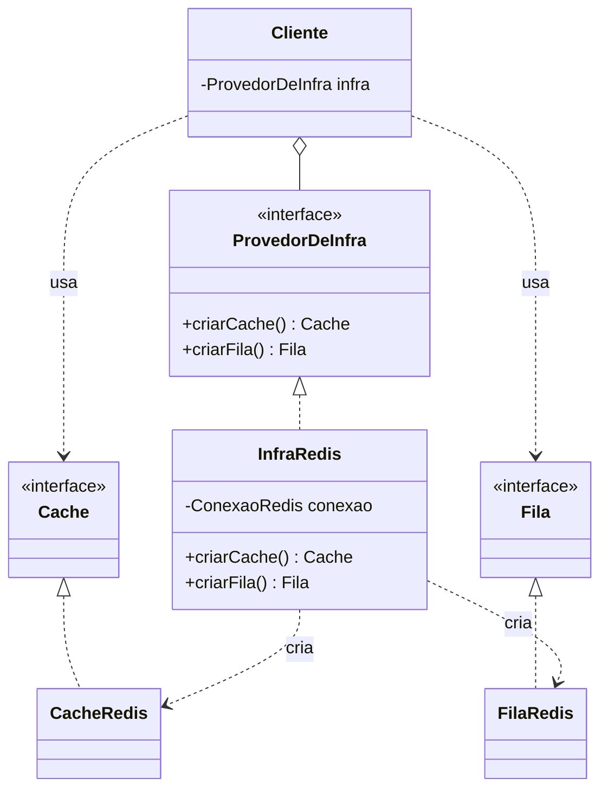

# Abstract Factory

Garante que um grupo de objetos que precisam funcionar juntos venha todo do mesmo lugar — e torna impossível montar a combinação errada.

---

## O problema

Você tem uma exportação de relatório que não roda na hora: a API recebe os filtros, enfileira o trabalho, e um worker processa depois. O payload é grande demais para caber na mensagem, então ele vai para o cache sob uma chave, e a fila carrega **só a chave**.

```ts
class AgendadorDeExportacao {
  private cache: Cache
  private fila: Fila

  constructor(cache: Cache, fila: Fila) {
    this.cache = cache
    this.fila = fila
  }

  agendar(filtros: Filtros): void {
    const chave = `export:${randomUUID()}`
    this.cache.set(chave, filtros)    // o payload vai para o cache
    this.fila.publicar({ chave })     // a mensagem carrega só o ponteiro
  }
}
```

Essa classe está bem escrita. Ela não conhece Redis, não conhece SQS, depende só das interfaces `Cache` e `Fila` — [DIP](https://github.com/JoaoVitorLima242/project-patterns/tree/main/docs/principios/dip) aplicado direitinho. O wiring liga as pontas:

```ts
const conexao = new ConexaoRedis(url)
new AgendadorDeExportacao(new CacheRedis(conexao), new FilaRedis(conexao))
```

Funciona. Três meses depois, alguém precisa rodar a aplicação localmente sem subir o Redis, escreve uma `FilaEmMemoria`, e liga assim:

```ts
new AgendadorDeExportacao(new CacheRedis(conexao), new FilaEmMemoria())
```

**Isso compila, passa nos testes e está errado.** O worker roda em outro processo: ele tira a chave da fila e vai buscar o payload num cache que não é o mesmo. O erro não aparece na subida — aparece em produção, intermitente, com um log dizendo "payload não encontrado" que não aponta para lugar nenhum.

E repare onde o bug **não** está: não está no `CacheRedis`, que está correto; não está na `FilaEmMemoria`, que está correta; não está no `AgendadorDeExportacao`, que está correto. Está na **combinação** — e não existe uma linha de código em lugar nenhum dizendo que essa combinação é ilegal.

O momento em que o cache e a fila deixaram de ser independentes foi quando passaram a compartilhar uma conexão. Só que o sistema de tipos não registra isso. Ele deixa você trocar um sem trocar o outro exatamente porque o DIP fez o trabalho dele: cada dependência é substituível **sozinha**. Aqui, não deveria ser.

## A ideia

Se a família é o que precisa ser escolhida, então **a família vira o objeto**. Ninguém instancia `CacheRedis` diretamente: você pede um cache para a família, e ela é quem sabe da conexão.

```ts
interface ProvedorDeInfra {
  criarCache(): Cache
  criarFila(): Fila
}

class InfraRedis implements ProvedorDeInfra {
  private conexao: ConexaoRedis

  constructor(url: string) {
    this.conexao = new ConexaoRedis(url)   // o recurso compartilhado mora AQUI
  }

  criarCache(): Cache { return new CacheRedis(this.conexao) }
  criarFila(): Fila   { return new FilaRedis(this.conexao) }
}
```

O detalhe que o diagrama de classes esconde é o mais importante: **o estado compartilhado mora na fábrica concreta.** A conexão é o motivo pelo qual os produtos não podem ser escolhidos separadamente — e é por isso que só a fábrica pode criá-los.

### Família × hierarquia

Duas palavras do próprio GoF resolvem quase toda a confusão em torno deste pattern, e ficam claras numa matriz:

```
                  Cache              Fila             Lock
  Redis   │  CacheRedis      │  FilaRedis      │  LockRedis      │  ← uma FAMÍLIA
 Memória  │  CacheEmMemoria  │  FilaEmMemoria  │  LockEmMemoria  │  ← outra família
          └──────────────────┴─────────────────┴─────────────────┘
                   ↑ uma HIERARQUIA de produto
```

- **Hierarquia de produto** é uma coluna: as variantes de **um** produto.
- **Família de produtos** é uma linha: um produto de **cada** coluna, feitos para funcionar juntos.

Com esse vocabulário, três frases ficam precisas:

- O [Factory Method](https://github.com/JoaoVitorLima242/project-patterns/tree/main/docs/patterns/criacionais/factory-method) escolhe **uma célula**. O Abstract Factory entrega **uma linha inteira**.
- Uma fábrica concreta **é** uma linha da matriz transformada em objeto.
- O pattern existe para impedir que você monte uma **diagonal** — pegando de linhas diferentes.

E é daí que sai o custo, que aparece de novo lá nos [Trade-offs](#trade-offs): **linha nova é barata, coluna nova quebra tudo.**

### Por que precisa ser um objeto

A pergunta de fundo é: por que não basta declarar que `CacheRedis` e `FilaRedis` são da mesma família?

Porque **não existe como dizer isso.** Java, C# e TypeScript não sabem expressar no sistema de tipos que este `Cache` e esta `Fila` pertencem ao mesmo conjunto — o nome acadêmico do problema é *family polymorphism*, e a maioria das linguagens de mercado simplesmente não tem essa construção.

O Abstract Factory é o contorno: já que o compilador não garante a coerência da família, você promove a família a **objeto em tempo de execução** e faz a garantia por construção.

> Abstract Factory é uma limitação do sistema de tipos resolvida com um objeto.

## Estrutura



Leia o diagrama pela divisão: **tudo que o cliente toca é abstrato.** As classes concretas aparecem uma única vez no sistema, e quem as cita é a fábrica concreta. Se o cliente conhece `CacheRedis`, o pattern não está fazendo nada.

## Participantes

| Papel (GoF) | No exemplo | Responsabilidade |
| --- | --- | --- |
| `AbstractFactory` | `ProvedorDeInfra` | Declara um método de criação por hierarquia de produto. É a interface que **define** o que compõe a família. |
| `ConcreteFactory` | `InfraRedis`, `InfraEmMemoria` | Uma linha da matriz. Guarda o recurso compartilhado e cria só produtos da própria variante. |
| `AbstractProduct` | `Cache`, `Fila` | As interfaces que o cliente conhece — uma por coluna. |
| `ConcreteProduct` | `CacheRedis`, `FilaRedis` | O que é criado de fato. Ninguém fora da fábrica cita o nome deles. |
| `Client` | `AgendadorDeExportacao` | Recebe a fábrica e usa só abstrações. Nunca escolhe produto, só recebe a família. |

## Onde ele entra

O Abstract Factory é o último degrau de uma escada em que cada passo adiciona exatamente uma coisa. A confusão mais comum é chamar de Abstract Factory algo que parou no primeiro degrau:

| Situação | Nome |
| --- | --- |
| Mesma interface, implementações diferentes | **Polimorfismo** — não é pattern |
| Um produto, escolhido por um `switch` sobre um parâmetro | **Simple Factory** — não é pattern do GoF |
| Um produto, escolhido por qual subclasse do criador foi instanciada | **Factory Method** |
| **Vários** produtos que precisam vir da **mesma** variante | **Abstract Factory** |

Duas palavras separam este pattern do degrau de baixo, e as duas são obrigatórias:

- **Plural.** Não é um produto com várias implementações — são vários produtos, cada um com as suas. Se for um só, você está no Factory Method ou numa Simple Factory.
- **Coerência.** Pegar de variantes diferentes tem que ser **errado**, não só incomum. Se dá para misturar sem quebrar nada, são duas dependências independentes e injeção de dependência resolve.

> A palavra que define o pattern não é "estrutura". É **junto**.

A página do [Factory Method](https://github.com/JoaoVitorLima242/project-patterns/tree/main/docs/patterns/criacionais/factory-method) tem a tabela completa das quatro coisas diferentes que carregam a palavra "factory", incluindo *static factory method*. A régua entre os dois patterns de verdade, do *Head First*: **Factory Method usa herança; Abstract Factory usa composição.**

## Implementação

<details>
<summary><b>TypeScript — a classe, e o que ela vira com closure</b></summary>

```ts
interface ProvedorDeInfra {
  criarCache(): Cache
  criarFila(): Fila
}

class InfraRedis implements ProvedorDeInfra {
  private conexao: ConexaoRedis

  constructor(url: string) {
    this.conexao = new ConexaoRedis(url)   // o recurso que amarra a família
  }

  criarCache(): Cache { return new CacheRedis(this.conexao) }
  criarFila(): Fila   { return new FilaRedis(this.conexao) }
}
```

A classe existe só para guardar a conexão. Onde há closure, a mesma garantia sai sem ela:

```ts
function infraRedis(url: string): ProvedorDeInfra {
  const conexao = new ConexaoRedis(url)    // a closure guarda o recurso compartilhado

  return {
    criarCache: () => new CacheRedis(conexao),
    criarFila:  () => new FilaRedis(conexao),
  }
}
```

Repare no que **não** sumiu: a interface `ProvedorDeInfra`. Ela é o pattern. A classe concreta é só uma das formas de implementá-la — diferente do Factory Method, que precisa da herança para existir.

</details>

<details>
<summary><b>Python — tipagem estrutural, sem herdar de nada</b></summary>

```python
class ProvedorDeInfra(Protocol):
    def criar_cache(self) -> Cache: ...
    def criar_fila(self) -> Fila: ...


class InfraRedis:                                  # não herda de ProvedorDeInfra
    def __init__(self, url: str) -> None:
        self._conexao = ConexaoRedis(url)          # o recurso que amarra a família

    def criar_cache(self) -> Cache:
        return CacheRedis(self._conexao)

    def criar_fila(self) -> Fila:
        return FilaRedis(self._conexao)
```

Com `Protocol`, a conformidade é estrutural: quem tiver os dois métodos é um provedor, sem declarar nada. O type checker cobra a família em tempo de análise e o runtime não paga por isso.

O efeito colateral é honesto: sem `implements`, a família deixa de ser óbvia lendo a classe. Em Python o pattern fica mais barato de escrever e mais fácil de furar.

</details>

<details>
<summary><b>Java — e o Abstract Factory que você já usou</b></summary>

```java
interface ProvedorDeInfra {
    Cache criarCache();
    Fila  criarFila();
}

class InfraRedis implements ProvedorDeInfra {
    private final ConexaoRedis conexao;   // o recurso que amarra a família

    InfraRedis(String url) {
        this.conexao = new ConexaoRedis(url);
    }

    @Override public Cache criarCache() { return new CacheRedis(conexao); }
    @Override public Fila  criarFila()  { return new FilaRedis(conexao); }
}
```

Se isso parece cerimonioso demais para ser usado de verdade, vale saber que você já usou — várias vezes:

```java
Connection conn = DriverManager.getConnection(url);   // a ConcreteFactory
Statement st    = conn.createStatement();             // produtos da MESMA família
PreparedStatement ps = conn.prepareStatement(sql);
Blob blob       = conn.createBlob();
```

`java.sql.Connection` é um Abstract Factory: `Statement`, `PreparedStatement` e `Blob` são todos abstrações, e as implementações concretas vêm do driver que você carregou. Você nunca escreve `new OracleStatement()`, e **não existe** como usar um `Statement` da Oracle numa conexão Postgres. É exatamente a garantia deste pattern, e ela é tão invisível que quase ninguém percebe que está ali.

O mesmo vale para `java.nio.file.FileSystem`, que cria `Path`, `WatchService` e `PathMatcher` — um `Path` de um filesystem de ZIP não funciona no filesystem padrão.

</details>

## Quando usar

- **O wiring não é seu.** Biblioteca, framework, sistema de plugins. Você publica `ProvedorDeInfra` e alguém pluga um `InfraDynamoDB` que você jamais vai ver. É o argumento mais forte, e o mesmo que faz o [Factory Method](https://github.com/JoaoVitorLima242/project-patterns/tree/main/docs/patterns/criacionais/factory-method) existir.
- **A variante é escolhida em runtime, repetidas vezes.** Por tenant, por região, por feature flag. Um `if` no boot não serve quando a família muda por requisição — você precisa que "a família Redis" seja um **objeto que se passa adiante**.
- **A montagem acontece em muitos lugares.** Escopo por requisição, por job, por conexão. Cada montagem à mão é uma chance de errar a combinação; a fábrica é montada uma vez.
- **Alguém precisa ser dono do recurso compartilhado.** A conexão precisa ser aberta e **fechada**. Montado à mão, o ciclo de vida dela não é responsabilidade de ninguém. A fábrica abre, distribui e fecha.

## Quando NÃO usar

A pergunta certa a se fazer antes de adotar o pattern é: **quantos lugares no código chamam `new CacheRedis(...)`?** Se a resposta for "um", pare aqui.

- **Quando só existe uma variante.** `ProvedorDeInfra` com uma única implementação é uma interface que não abstrai nada — [YAGNI](https://github.com/JoaoVitorLima242/project-patterns/tree/main/docs/principios/dry-kiss-yagni) com nome de pattern. Instanciar as três linhas direto está **certo**, não é uma versão ingênua de nada:

  ```ts
  const conexao = new ConexaoRedis(url)
  const cache = new CacheRedis(conexao)
  const fila  = new FilaRedis(conexao)
  ```

- **Quando são duas variantes montadas uma vez, num lugar que é seu.** Um `if` no composition root entrega a mesma garantia sem interface nenhuma:

  ```ts
  const infra = ehProducao
    ? { cache: new CacheRedis(conexao), fila: new FilaRedis(conexao) }
    : { cache: new CacheEmMemoria(mapa), fila: new FilaEmMemoria(mapa) }
  ```

  O pattern não cria objetos melhor que isso. Ele **elimina a possibilidade da combinação errada existir** — e se existe um único lugar que monta a família, essa possibilidade já não existia. Você estaria pagando por uma garantia que já tinha de graça.

- **Quando as variantes podem ser misturadas sem quebrar nada.** Esse é o teste de bolso, e ele reprova a maioria dos candidatos:

  > **Misture as variantes. O que quebra?**
  > Se a resposta é "nada, só fica esquisito", não é família — são dependências independentes, e injeção de dependência resolve melhor e mais barato.
  > Se é "não compila, corrompe estado, ou fica visivelmente quebrado", aí sim.

- **Quando o que você quer é só agrupar as dependências de infra numa classe só.** Esse é o motivo errado mais comum para chegar aqui. Uma classe que centraliza a criação é um *composition root* ou uma Facade — útil, legítimo, e sem nenhuma das duas propriedades do pattern.
- **Quando é um produto só.** Uma "fábrica" com um método de criação não é Abstract Factory, por mais abstrata que a interface seja. Sem plural, não há família.

## Trade-offs

| Ganha | Paga |
| --- | --- |
| A combinação errada deixa de ser expressável — o compilador cobra o que antes era convenção | Uma interface e uma classe concreta por variante, antes de qualquer linha útil |
| Variante nova não toca em código existente ([OCP](https://github.com/JoaoVitorLima242/project-patterns/tree/main/docs/principios/ocp) de verdade) | **Produto novo quebra todas as fábricas concretas de uma vez** |
| O recurso compartilhado ganha um dono: abre, distribui e fecha | Mais indireção entre "quero um cache" e "recebi um cache" |
| O cliente depende só de abstrações ([DIP](https://github.com/JoaoVitorLima242/project-patterns/tree/main/docs/principios/dip)) | A variante é escolhida cedo, num lugar só — trocar no meio do caminho não é o que o pattern oferece |

O custo da segunda linha tem nome técnico: é o **Problema da Expressão**. O design é aberto numa dimensão e fechado na outra, e trocar de lado é caro. Aqui, o pattern é **aberto para variantes e fechado para produtos** — adicionar `criarLock()` na interface obriga a mexer em toda fábrica que existe. Não é falta de cuidado no design; é a natureza dele, e é o oposto exato do que quase todo mundo assume ao adotar.

E tem um custo que só aparece depois: **a interface nivela por baixo.** Assim que `ProvedorDeInfra` existe, todo produto precisa caber nela, e ela encolhe até o denominador comum entre as variantes. O Redis tem `SCAN`, pipeline e TTL por chave; o mapa em memória não tem. Ou a interface finge que esses recursos não existem, ou vaza a variante e perde o sentido. Você trocou "posso usar o Redis inteiro" por "posso trocar de variante" — e se nunca vai trocar, pagou sem receber. É [ISP](https://github.com/JoaoVitorLima242/project-patterns/tree/main/docs/principios/isp) cobrando pelo outro lado.

## Patterns relacionados

- [**Factory Method**](https://github.com/JoaoVitorLima242/project-patterns/tree/main/docs/patterns/criacionais/factory-method) — um produto por herança × uma família por composição. Uma célula da matriz × uma linha inteira. Na prática, cada método da fábrica abstrata costuma ser implementado como um Factory Method.
- **Builder** — responde "como construir" um objeto complexo, passo a passo; o Abstract Factory responde "de qual família". Builder devolve um produto no fim; a fábrica devolve vários, a qualquer momento.
- **Prototype** — uma variação que o GoF documenta: em vez de uma subclasse por família, a fábrica guarda protótipos e clona. Elimina a explosão de classes concretas quando há muitas famílias.
- **Singleton** — o GoF observa que basta uma instância de cada `ConcreteFactory`. No exemplo desta página isso importa por um motivo concreto: ela é dona da conexão, então o tempo de vida dela é o tempo de vida do recurso.
- **Facade** — o que muita gente constrói achando que é Abstract Factory. A Facade simplifica o acesso a um subsistema; ela não garante coerência entre variantes, porque não existem variantes.
- [**Composição vs. Herança**](https://github.com/JoaoVitorLima242/project-patterns/tree/main/docs/principios/composition-vs-inheritance) — a fronteira exata com o Factory Method: aqui a família é recebida como objeto, não escolhida por qual subclasse foi instanciada.
- [**Dependency Inversion (DIP)**](https://github.com/JoaoVitorLima242/project-patterns/tree/main/docs/principios/dip) — o pattern é DIP levado ao plural: não basta depender de abstrações, é preciso garantir que elas venham da mesma implementação.
- [**Interface Segregation (ISP)**](https://github.com/JoaoVitorLima242/project-patterns/tree/main/docs/principios/isp) — a tensão direta: cada produto novo engorda a fábrica abstrata, e toda variante paga por métodos que talvez não faça sentido implementar.

## Referências

- **Design Patterns: Elements of Reusable Object-Oriented Software** — Gamma, Helm, Johnson & Vlissides (1994), p. 87. A definição original, o nome alternativo **Kit**, e as notas de implementação: `ConcreteFactory` como Singleton, fábricas baseadas em Prototype e fábricas extensíveis (`criar(id)`), que trocam segurança de tipo por flexibilidade.
- **Head First Design Patterns** — Freeman & Robson, cap. 4. Desenvolve Simple Factory, Factory Method e Abstract Factory no mesmo exemplo, e fixa a régua "herança × composição".
- **Family Polymorphism** — Erik Ernst, ECOOP 2001. Nomeia o problema que o pattern contorna: tipos que só fazem sentido em conjunto, e que as linguagens de mercado não sabem expressar.
- **The Expression Problem** — Philip Wadler (1998). O nome técnico do trade-off de aberto numa dimensão, fechado na outra.
- **Dependency Injection Principles, Practices, and Patterns** — Seemann & van Deursen. O *Composition Root*, que é o principal concorrente deste pattern e resolve a maioria dos casos.
- [Abstract Factory](https://refactoring.guru/design-patterns/abstract-factory) — Refactoring Guru. A explicação visual da matriz de famílias e variantes.
