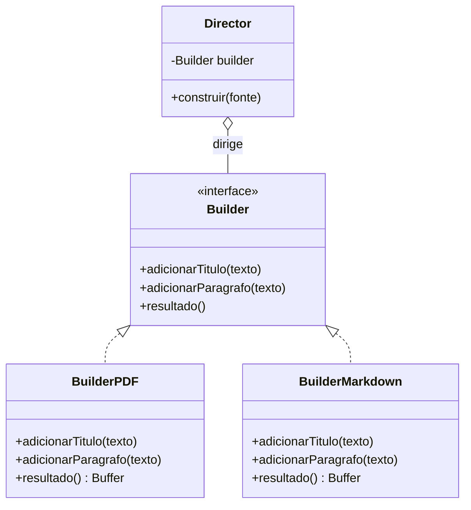
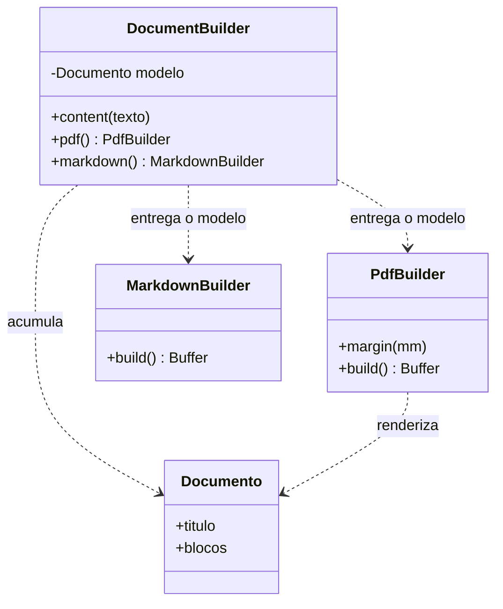

# Builder

Monta um objeto em etapas — e, na versão original, separa quem descreve **o que** construir de quem decide **qual formato** sai no fim.

---

## O problema

Você tem um gerador de documento. Ele recebe título e conteúdo, e precisa devolver o arquivo em markdown, PDF, docx ou txt. A primeira versão é um construtor:

```ts
new Document("ola mundo", "Ola", "pdf", 20, false, null).render()
```

Isso funciona no dia em que foi escrito e fica pior a cada semana. Seis meses depois, ninguém lê essa linha: o que é `20`? O que é `false`? E os dois primeiros parâmetros são `string` — trocar título por conteúdo compila, roda, e gera um documento errado sem nenhum aviso.

A saída óbvia é trocar o construtor por setters:

```ts
const doc = new Document()
doc.setTitulo("ola mundo")
doc.setConteudo("Ola")
doc.setFormato("pdf")
```

Legível, e pior. Agora existe um `Document` **válido pela metade** entre a primeira e a última linha, e nada impede alguém de chamar `render()` no meio. Você trocou ilegibilidade por estado inconsistente.

Mas repare que há **duas dores diferentes** amontoadas nessa linha, e é aí que o assunto costuma embolar:

1. **Parâmetros demais.** Opcionais, do mesmo tipo, sem nome. É um problema de legibilidade e de segurança na chamada.
2. **O `20` não é de todo mundo.** Margem só existe em PDF. Sumário só existe em docx. O mesmo conteúdo precisa sair como quatro coisas diferentes, e cada uma tem opções que as outras não têm.

A primeira dor é a que quase todo texto sobre Builder trata. A segunda é a que o GoF escreveu o pattern para resolver.

## Os dois Builders

| | **Builder do GoF** (1994) | **Builder do *Effective Java*** (Item 2) |
| --- | --- | --- |
| Intenção | Mesmo processo de construção → **representações diferentes** | Construtor com **parâmetros demais** |
| Director | Sim — é dono do algoritmo de percurso | Não existe |
| Produtos | Vários, de tipos diferentes | Um só |
| Motivo de existir | Estrutural | Falta de argumento nomeado/opcional na linguagem |
| Some em Python/Kotlin/F#? | Não | **Sim** |

A definição original não deixa dúvida sobre qual dos dois problemas ela ataca:

> *"Separar a construção de um objeto complexo da sua representação, de modo que **o mesmo processo de construção** possa criar **representações diferentes**."* — GoF, p. 97

E os dois exemplos do livro são coerentes com isso. O principal é um conversor de RTF: um `RTFReader` percorre o documento **uma vez**, emitindo eventos — "token de texto", "mudança de fonte", "parágrafo". Quem responde é um `TextConverter`, e aí está a variação: o `ASCIIConverter` ignora formatação, o `TeXConverter` gera TeX, o `TextWidgetConverter` monta um widget de interface. Mesmo percurso, três representações.

O Builder do *Effective Java* não faz nada disso. Ele resolve o construtor telescópico, e a recomendação do Bloch é explícita: use builder *"quando construtores ou static factories teriam mais que um punhado de parâmetros, especialmente se muitos forem opcionais ou do mesmo tipo"*. Nenhum Director, um produto só, nenhuma representação alternativa.

Brandon Rhodes dá o critério que separa os dois em uma linha, e é o mais útil que existe sobre o assunto:

> **O Builder do GoF devolve o objeto construído. O builder de conveniência muitas vezes não devolve nada.**

E ele completa: quando o builder não devolve nada, ele deixou de ser Builder e virou **Facade**. O exemplo é o `pyplot` do matplotlib — `plt.plot()` cria uma dúzia de objetos por dentro e não te entrega nenhum. É conveniência, não construção.

Rhodes chama a versão do Bloch de **degenerate builder**: uma classe imutável emparelhada com um builder mutável, para suprir a falta de parâmetro opcional. Em Python, desnecessário.

## A ideia

O desenho que resolve as duas dores faz dois movimentos, e eles são independentes.

**O primeiro: o obrigatório não entra no builder.** Título e conteúdo passam pela porta de entrada, onde a linguagem já sabe cobrar. O builder fica só com o que é opcional.

**O segundo: acumular primeiro, decidir o formato depois.** As chamadas de conteúdo vão montando um modelo neutro do documento. Só no fim você escolhe o formato — e essa escolha decide **quem renderiza** e **quais opções passam a existir**.

```ts
Document.from({ title: "ola mundo", content: "Ola" })
  .content("mais um parágrafo")     // acumula
  .pdf()                            // escolhe a representação
  .margin(20)                       // opção que só existe no PDF
  .build()                          // → Buffer
```

O detalhe que faz isso funcionar é o que **não** está lá: `build()` não existe antes de `.pdf()`. Você não valida se o formato foi escolhido — você não oferece o método até que ele tenha sido.

> A garantia não é uma validação. É uma ausência.

É a mesma jogada do [Abstract Factory](https://github.com/JoaoVitorLima242/project-patterns/tree/main/docs/patterns/criacionais/abstract-factory): em vez de checar o erro, tornar o erro não-expressável.

E a classe se parte em duas responsabilidades que sempre estiveram lá: **acumular**, que não sabe nada de formato, e **renderizar**, que não sabe nada de como o conteúdo chegou.

## Estrutura

**O do GoF** — o Director conhece os passos, e cada builder concreto responde do seu jeito:



**O moderno** — some o Director, e entra uma representação intermediária:



A diferença entre os dois parece de estilo e não é. Ela decide quando cada um serve:

| | Moderno | GoF |
| --- | --- | --- |
| Representação intermediária | Existe — o `Documento` neutro | Não existe |
| Quando o formato entra | No fim, sobre o modelo pronto | Desde o primeiro passo |
| Cada builder concreto | Recebe tudo de uma vez | Vai acumulando a **própria** saída |
| Precisa de tudo em memória | Sim | **Não** |

É por isso que o exemplo do livro é um leitor de RTF, e não um gerador de documento. Com um arquivo de 2 GB, ou com dados chegando em stream, **não existe** um "modelo neutro completo" para renderizar depois — o builder precisa ir escrevendo a saída conforme os eventos chegam. Se cabe na memória, o desenho moderno é melhor: mais simples, e o modelo intermediário é inspecionável e testável sozinho.

## Participantes

| Papel (GoF) | No exemplo | Responsabilidade |
| --- | --- | --- |
| `Director` | — (some no desenho moderno) | Conhece a **ordem** dos passos. Não sabe o que sai no fim. |
| `Builder` | `DocumentBuilder` | Declara os passos de construção. |
| `ConcreteBuilder` | `PdfBuilder`, `MarkdownBuilder` | Implementa os passos e **guarda o resultado**. Só ele sabe o formato. |
| `Product` | `Buffer` | O que sai. Nem sempre tem interface comum entre os formatos — e é por isso que, no GoF, `resultado()` **não** fica na interface `Builder`. |

Esse último detalhe é o mais fácil de errar ao implementar: os produtos de builders diferentes podem não ter nada em comum, então quem pega o resultado precisa conhecer o builder concreto. Um PDF e um widget de interface não compartilham interface nenhuma.

## Implementação

<details>
<summary><b>TypeScript — acumulador + renderer</b></summary>

```ts
class DocumentBuilder {
  private titulo: string
  private blocos: Bloco[]

  constructor(titulo: string, conteudo: string) {
    this.titulo = titulo
    this.blocos = [paragrafo(conteudo)]
  }

  content(texto: string): this { this.blocos.push(paragrafo(texto)); return this }

  // não existe build() aqui — o formato ainda não foi escolhido
  pdf():      PdfBuilder      { return new PdfBuilder(this.modelo()) }
  markdown(): MarkdownBuilder { return new MarkdownBuilder(this.modelo()) }

  private modelo(): Documento {
    return { titulo: this.titulo, blocos: this.blocos }   // a representação intermediária
  }
}

class PdfBuilder {
  private doc: Documento
  private margem = 10

  constructor(doc: Documento) { this.doc = doc }

  margin(mm: number): this { this.margem = mm; return this }   // só o PDF tem isso
  build(): Buffer { /* renderiza o modelo */ }
}
```

Três garantias, e nenhum `if`:

```ts
Document.from({ title: "ola", content: "Ola" }).build()             // ❌ build() não existe ainda
Document.from({ title: "ola" })                                     // ❌ falta content
Document.from({ title: "ola", content: "Ola" }).markdown().margin(20) // ❌ margin não existe em Markdown
```

</details>

<details>
<summary><b>Python — onde o builder do Bloch simplesmente não nasce</b></summary>

```python
@dataclass(frozen=True)
class Documento:
    titulo: str                          # obrigatório — o type checker cobra
    conteudo: str
    margem: int = 10                     # opcional, com padrão
    rodape: str | None = None
```

Argumento nomeado, valor padrão e `frozen=True` entregam de uma vez as três coisas que o builder do *Effective Java* existe para dar: legibilidade na chamada, imutabilidade e campo obrigatório. Não sobra problema para o pattern resolver.

É a mesma história do [Factory Method](https://github.com/JoaoVitorLima242/project-patterns/tree/main/docs/patterns/criacionais/factory-method) virando função de primeira classe — e vale para Kotlin, C# e qualquer linguagem com parâmetro nomeado.

O que **não** some é a outra metade, porque o problema dela é outro:

```python
doc = Documento(titulo="ola mundo", conteudo="Ola")

RENDERIZADORES = {
    'pdf':      renderizar_pdf,          # mesmo modelo, representações diferentes
    'markdown': renderizar_markdown,
    'docx':     renderizar_docx,
}

renderizar = RENDERIZADORES['pdf']
buffer = renderizar(doc)
```

Em Python o "ConcreteBuilder" vira uma função no dicionário. A estrutura de classes desaparece; a **separação entre modelo e representação**, não.

</details>

<details>
<summary><b>Java — o clássico do <i>Effective Java</i>, e o que o JDK já faz</b></summary>

```java
public class Documento {
    private final String titulo;      // obrigatório
    private final int margem;         // opcional

    public static class Builder {
        private final String titulo;  // obrigatórios no construtor do Builder
        private int margem = 10;

        public Builder(String titulo) { this.titulo = titulo; }

        public Builder margem(int mm) { this.margem = mm; return this; }
        public Documento build()      { return new Documento(this); }
    }
}
```

Repare em onde o obrigatório entra: **no construtor do `Builder`**, não num método encadeado. É a parte do Item 2 que quase todo mundo copia errado.

O JDK usa exatamente esse desenho:

```java
HttpRequest.newBuilder(uri)                      // a URI é obrigatória e está AQUI
    .header("Accept", "application/json")
    .timeout(Duration.ofSeconds(10))
    .build();
```

E não é caso isolado — `Locale.Builder` (Java 7), `Calendar.Builder` (Java 8) e `Stream.Builder` (Java 8) seguem a mesma forma.

Vale notar o que o Lombok diz sobre isso: se `@Builder` consegue **gerar** o builder inteiro a partir dos campos, então ele nunca foi uma decisão de design — é boilerplate que a linguagem deveria ter evitado. É o argumento do Rhodes e do Seemann, provado por ferramenta.

</details>

## Como tornar um campo realmente obrigatório

Essa é a pergunta prática que o pattern levanta e que quase nenhum texto responde. Da mais barata para a mais cara:

| Mecanismo | Como funciona | Custo |
| --- | --- | --- |
| **Na porta de entrada** | Factory estática com objeto de parâmetros; construtor privado | Nenhum. É o desenho do Bloch e do `HttpRequest` |
| **Interfaces por etapa** | Cada passo devolve uma interface que só expõe o próximo | **A ordem fica fixa** |
| **Type-state com genérico** | O tipo rastreia o que falta; `build()` só existe quando não falta nada | Mensagem de erro ilegível, e frágil |
| **Validar no `build()`** | `if (!this.titulo) throw ...` | O erro só aparece em runtime |

A primeira resolve quase sempre, e tem uma condição que é fácil de perder:

```ts
new DocumentBuilder().pdf().build()                  // ❌ tem que ser impossível
Document.from({ title, content }).pdf().build()      // ✅ único caminho
```

**Só existe garantia se a factory for o único jeito de obter um builder.** Construtor privado, uma entrada estática, e o objeto de parâmetros com os campos não-opcionais. Se `from()` for apenas mais um passo encadeado, o compilador não tem como saber que ele foi chamado — e você voltou para o `if` no `build()`.

Um objeto de parâmetros resolve de brinde o problema dos dois `string` na mesma assinatura: `{ title, content }` não tem como inverter.

## Builder de dados de teste

Esse é o uso mais frequente do pattern no dia a dia, e o único que **não** é cicatriz de linguagem.

O ponto de partida é o *Object Mother*: uma classe com métodos de fábrica para os objetos usados nos testes. Nat Pryce documentou por que ela azeda — ou duplica código, ou vira dezenas de métodos minúsculos que só embrulham um `new`. A alternativa é um builder por classe, com **padrões seguros em tudo** e métodos encadeáveis para sobrescrever só o que interessa:

```ts
umPedido().build()                            // um pedido válido qualquer
umPedido().comCupom('BLACK50').build()        // o teste do cupom fala só de cupom
umPedido().semEntrega().build()               // o teste da entrega fala só de entrega
```

O ganho aqui não é parâmetro opcional — é **o teste declarar apenas o que é relevante para ele**. Tudo que aparece na linha é, por definição, o que está sob teste; o resto é ruído que o builder absorveu. Por isso ele sobrevive em Python, onde o builder do Bloch nem nasce: `um_pedido(cupom='BLACK50')` ainda te obriga a saber quais campos são obrigatórios.

O contraponto honesto vem do Mark Seemann, que escreveu a série mais completa sobre isso e conclui que o padrão *"endereça várias deficiências de linguagem"* e seria em boa parte redundante com registros imutáveis e `with`. Em C# e F# o argumento dele já chegou. Em TypeScript e Java, ainda não.

## Quando usar

- **O mesmo conteúdo precisa sair em representações diferentes.** É o caso do GoF, e o único em que o pattern é estrutural em vez de cosmético.
- **A entrada é grande demais para caber em memória, ou chega em stream.** Aí não há como montar um modelo intermediário, e o Builder com Director é a única saída.
- **O objeto é imutável e tem muitos campos opcionais**, especialmente se vários forem do mesmo tipo. É o critério do Bloch, e ele exige a linguagem certa: em Java e TypeScript, sim; em Python, não.
- **Dados de teste.** Padrões seguros no que não importa, sobrescrita explícita no que importa.

## Quando NÃO usar

- **Quando são poucos campos e todos obrigatórios.** Um construtor resolve, e resolve melhor: o compilador cobra tudo, sem classe extra e sem indireção. Builder para três campos obrigatórios é cerimônia.
- **Quando a linguagem tem argumento nomeado e valor padrão.** Python, Kotlin, C#, Swift. O builder do *Effective Java* existe para suprir uma falta que essas linguagens não têm — escrevê-lo ali é importar um problema junto com a solução.
- **Quando o builder não devolve o objeto.** É o teste do Rhodes: se as chamadas produzem efeito e você nunca recebe nada de volta, aquilo é uma **Facade** sobre um subsistema. Continua útil, só não é este pattern, e chamá-lo de Builder atrapalha quem for mexer depois.
- **Quando existe um formato só.** Sem representações alternativas e sem campos opcionais, o encadeamento é um construtor com passos a mais. A corrente fica bonita e não compra nada.
- **Quando o produto é mutável de qualquer jeito.** Metade do valor do builder é entregar um objeto imutável e já consistente. Se a classe tem setters públicos, o builder está guardando uma porta que ficou aberta do outro lado.

## Trade-offs

| Ganha | Paga |
| --- | --- |
| Chamada legível, e parâmetros do mesmo tipo deixam de trocar de lugar | Uma classe a mais por produto |
| Objeto imutável mesmo com muitos campos opcionais | A lista de campos aparece duas vezes e **desalinha com o tempo** |
| O formato decide quais opções existem (`margin` só no PDF) | Um tipo a mais por formato |
| Extensão por representação nova sem tocar em quem já usa | **Campo obrigatório esquecido só estoura em runtime**, salvo com step builder |

O trade-off central quase nunca é dito em voz alta, e é o que mais importa na hora de escolher:

> O construtor telescópico é ilegível e **seguro**. O builder é legível e **adia o erro para a execução**.

Você troca verificação em tempo de compilação por legibilidade. Dá para recuperar a verificação — interfaces por etapa, factory de entrada —, mas cada mecanismo cobra em rigidez ou em boilerplate. Escolher é o trabalho; sair encadeando sem escolher é como o bug chega em produção.

E há um custo que aparece no próprio exemplo desta página: **o `Buffer` achata as representações.** O GoF fala em "representações diferentes", mas o tipo de retorno é um só. A diferença entre um PDF e um Markdown existe em runtime e não no sistema de tipos — nada impede escrever o buffer de um PDF num arquivo `.md`. Tipos distintos por formato resolvem, ao custo de mais um tipo por representação.

## Patterns relacionados

- [**Abstract Factory**](https://github.com/JoaoVitorLima242/project-patterns/tree/main/docs/patterns/criacionais/abstract-factory) — a régua é do próprio GoF: **o Builder devolve o produto como passo final; no Abstract Factory o produto é devolvido imediatamente.** Builder responde "como construir", a fábrica responde "de qual família".
- [**Factory Method**](https://github.com/JoaoVitorLima242/project-patterns/tree/main/docs/patterns/criacionais/factory-method) — a porta de entrada estática (`Document.from`) é o *static factory method* do Item 1 do Bloch a serviço do Item 2. São coisas diferentes que se encaixam.
- **Composite** — a representação intermediária costuma ser um: um documento é uma árvore de blocos, e cada bloco pode conter outros.
- **Facade** — o vizinho perigoso. Builder que não devolve o objeto construído já virou Facade, mesmo que o nome da classe diga outra coisa.
- **Prototype** — clonar um objeto pronto e ajustar × montar do zero passo a passo. Quando as variações são pequenas sobre uma base comum, clonar costuma custar menos.
- [**Encapsulamento**](https://github.com/JoaoVitorLima242/project-patterns/tree/main/docs/principios/encapsulation) — metade do motivo de o builder existir: manter o produto imutável e nunca deixá-lo visível pela metade.
- [**DRY, KISS, YAGNI**](https://github.com/JoaoVitorLima242/project-patterns/tree/main/docs/principios/dry-kiss-yagni) — a régua contra a cerimônia. Builder para três campos obrigatórios é o exemplo canônico de complicar sem comprar nada.

## Referências

- **Design Patterns: Elements of Reusable Object-Oriented Software** — Gamma, Helm, Johnson & Vlissides (1994), p. 97. A definição original, o `RTFReader`/`TextConverter` (mesmo percurso → ASCII, TeX, widget) e o `MazeBuilder`. Também a régua contra o Abstract Factory: aqui o produto sai no passo final.
- **Effective Java** — Joshua Bloch, Item 2 ("Consider a builder when faced with many constructor parameters"). O construtor telescópico, por que JavaBeans não serve, e os obrigatórios no construtor do `Builder`.
- [The Builder Pattern](https://python-patterns.guide/gang-of-four/builder/) — Brandon Rhodes. O critério que separa os dois: o Builder do GoF **devolve** o objeto construído. Chama a versão do Bloch de *degenerate builder* e mostra o `pyplot` como builder que virou Facade.
- [Test Data Builders: an alternative to the Object Mother pattern](http://www.natpryce.com/articles/000714.html) — Nat Pryce. A origem do builder de dados de teste, e por que o Object Mother azeda.
- [Test Data Builders in C#](https://blog.ploeh.dk/2017/08/15/test-data-builders-in-c/) — Mark Seemann. A dissidência: o padrão *"endereça várias deficiências de linguagem"* e seria redundante com linguagens melhores.
- [HttpRequest.Builder](https://docs.oracle.com/en/java/javase/21/docs/api/java.net.http/java/net/http/HttpRequest.Builder.html) — Javadoc. O obrigatório na porta, o opcional encadeado.
- [Builder](https://refactoring.guru/design-patterns/builder) — Refactoring Guru. A estrutura com Director desenhada passo a passo.
