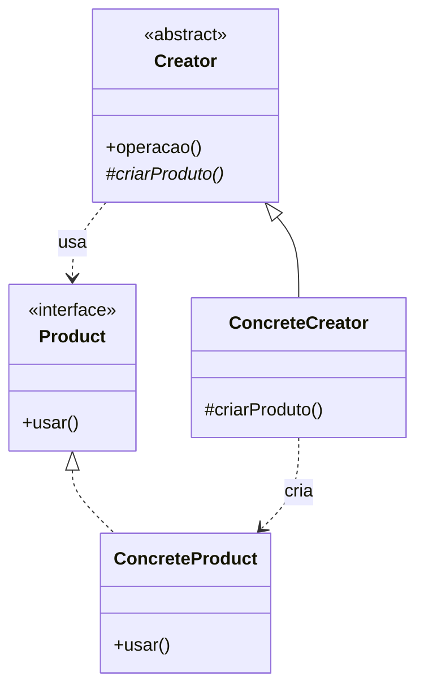

# Factory Method

Deixa uma classe pronta criar objetos que ela não conhece: em vez de dar `new` numa classe concreta, ela chama um método que quem herda dela preenche.

> [!WARNING]
> Se o que você chama de "factory" é uma classe com um `switch` sobre um parâmetro de tipo, este não é o pattern que você usa — e você não está errado, o nome é que é sobrecarregado. A seção [Não confunda](#não-confunda) dá o nome certo para cada coisa. Adiantando o principal: **aqui não existe nenhuma classe terminada em `Factory`.**

---

## O problema

Você escreveu uma classe que simula uma chuva de meteoros:

```ts
class Simulacao {
  rodar(qtd: number) {
    for (let i = 0; i < qtd; i++) {
      const m = new Meteoro()      // <-- só esta linha
      this.mover(m)
      this.desenhar(m)
      this.checarColisao(m)
    }
  }
}
```

O código está bom. O laço, o `mover`, o `desenhar`, o `checarColisao` — tudo isso é idêntico para qualquer tipo de meteoro, e você não quer tocar em nada disso nunca mais.

Agora aparece o meteoro de gelo, que derrete ao entrar na atmosfera. E o de pedra, que se fragmenta. O único pedaço que precisa mudar é **uma linha**: `new Meteoro()` teria que ser `new MeteoroDeGelo()`.

Três saídas:

1. **Copiar a classe inteira** e trocar a linha. Quarenta linhas duplicadas por causa de uma.
2. **Receber o tipo por parâmetro e dar um `switch`** ali dentro. Funciona, e na maior parte do código de aplicação é o que eu faria. Mas a `Simulacao` passa a conhecer todo tipo de meteoro que existe, e cada tipo novo abre a classe de novo.
3. **Tirar a decisão daquela linha.**

A saída 2 tem um limite duro, e é ele que faz o pattern existir: **ela exige que você conheça todos os tipos.** Se `Simulacao` estiver dentro de uma biblioteca que você publica, quem instalar vai inventar `MeteoroDePlasma` — uma classe que ainda não existe e que você jamais vai ver. Não dá para escrever um `switch` sobre classes que não existem.

Não é coincidência que o exemplo com que o próprio GoF apresenta o pattern seja um framework (`Application` criando `Document`), e não código de aplicação. É o argumento inteiro.

## A ideia

Você transforma aquela linha num buraco. A classe base declara que **precisa** de um meteoro, sem dizer qual, e quem herda dela preenche:

```ts
abstract class Simulacao {
  protected abstract criarMeteoro(): Meteoro   // o buraco — ESTE é o Factory Method

  rodar(qtd: number) {
    for (let i = 0; i < qtd; i++) {
      const m = this.criarMeteoro()            // não sei qual vem. quem herdou de mim sabe.
      this.mover(m)
      this.checarColisao(m)
    }
  }
}
```

Duas coisas mudaram, e as duas importam:

- **`rodar()` foi escrito uma vez** e nunca mais é tocado, mesmo com dez tipos de meteoro.
- **Não existe `switch` em lugar nenhum.** A escolha não é feita por um `if` em tempo de execução; ela já estava resolvida no instante em que alguém escreveu `new SimulacaoDeGelo()`.

E aqui está o que mais trava quem tenta entender o pattern: **não existe uma classe `MeteoroFactory`.** O "factory" é um método solto dentro de uma classe que faz outra coisa completamente diferente. É literalmente o nome — método fábrica, não classe fábrica. Quem procura pela classe não acha, e conclui que não entendeu.

Repare também que **você nunca chama `criarMeteoro()`**. Quem chama é o `rodar()`, lá dentro, sozinho. Você só escolheu com qual classe começar:

```ts
MeteoroFactory.criar('gelo')       // Simple Factory: eu peço um tipo, recebo um objeto
new SimulacaoDeGelo().rodar(100)   // Factory Method: eu escolho o CRIADOR, e ele cria por dentro
```

## Estrutura

O que distingue o pattern são as **duas hierarquias paralelas**, ligadas por um único ponto: cada criador concreto sabe fabricar exatamente um produto concreto.



## Participantes

| Papel | Responsabilidade |
| --- | --- |
| `Creator` (`Simulacao`) | Tem o algoritmo de verdade. Declara o factory method e o chama no meio do trabalho. **Não é uma fábrica** — é uma classe que faz outra coisa e por acaso precisa criar algo. |
| `ConcreteCreator` (`SimulacaoDeGelo`) | Sobrescreve o factory method e escolhe a classe concreta. Costuma ser a única coisa que ela faz. |
| `Product` (`Meteoro`) | A interface que o `Creator` conhece e usa. |
| `ConcreteProduct` (`MeteoroDeGelo`) | O que é criado de fato. O `Creator` nunca cita o nome dele. |

## Não confunda

Quatro coisas diferentes carregam a palavra "factory", e só uma é este pattern. Essa é a maior fonte de confusão do assunto — e é honesta, porque três delas são úteis e legítimas.

| Nome | O que é | Onde mora a decisão | É pattern do GoF? |
| --- | --- | --- | :---: |
| **Simple Factory** | Uma classe com um método de criação e um `switch` dentro. `MeteoroFactory.criar('gelo')` | Num parâmetro, em tempo de execução | Não |
| **Static factory method** | Método estático que devolve instância da própria classe, com nome melhor que o construtor. `Duration.ofSeconds(30)`, `List.of(...)` | Não há decisão de tipo — é um construtor batizado | Não |
| **Factory Method** | Método abstrato dentro de uma classe que tem outro trabalho, preenchido pelas subclasses | Em qual subclasse do criador foi instanciada | **Sim** |
| **Abstract Factory** | Um objeto que cria uma **família** de produtos que variam juntos | No objeto-fábrica que foi passado para quem usa | Sim |

O teste de bolso:

> **Se existe um `switch`/`if` sobre um parâmetro de tipo, é Simple Factory. Se a escolha já está resolvida em qual subclasse do criador você instanciou, é Factory Method.**

Duas notas que valem por si:

- **Simple Factory não é um pattern**, e isso não é demérito. O termo foi batizado pelo *Head First Design Patterns* justamente para dar nome ao que as pessoas já faziam. Resolve a maioria dos casos reais e é a escolha certa com mais frequência do que o Factory Method.
- **Static factory method é outro assunto inteiro.** Bloch avisa no Item 1 do *Effective Java* que não tem relação com o pattern do GoF — o objetivo dele é dar *nome* à criação (`valueOf`, `getInstance`, `of`), não escolher classe. O mercado juntou os dois porque a palavra é a mesma.

E a régua entre os dois patterns de verdade, do *Head First*: **Factory Method usa herança; Abstract Factory usa composição.**

## Implementação

<details>
<summary><b>Java — o Factory Method clássico</b></summary>

```java
abstract class Simulacao {
    // A base declara o buraco. Ela não sabe, e não quer saber, o que vem.
    protected abstract Meteoro criarMeteoro();

    // O algoritmo é escrito uma vez e sobrevive a todo tipo de meteoro novo.
    public void rodar(int qtd) {
        for (int i = 0; i < qtd; i++) {
            Meteoro m = criarMeteoro();
            mover(m);
            checarColisao(m);
        }
    }
}

class SimulacaoDeGelo extends Simulacao {
    // A subclasse é o único lugar do sistema que cita MeteoroDeGelo.
    @Override
    protected Meteoro criarMeteoro() {
        return new MeteoroDeGelo();
    }
}
```

</details>

<details>
<summary><b>TypeScript — e o que ele vira quando há função de primeira classe</b></summary>

```ts
// 1. O pattern literal, com herança.
abstract class Simulacao {
  protected abstract criarMeteoro(): Meteoro

  rodar(qtd: number) {
    for (let i = 0; i < qtd; i++) this.checarColisao(this.criarMeteoro())
  }
}

class SimulacaoDeGelo extends Simulacao {
  protected criarMeteoro(): Meteoro { return new MeteoroDeGelo() }
}
```

```ts
// 2. A mesma flexibilidade, recebendo a fábrica por parâmetro.
//    Some a hierarquia inteira: uma classe, nenhuma subclasse.
class Simulacao {
  private criarMeteoro: () => Meteoro

  constructor(criarMeteoro: () => Meteoro) {
    this.criarMeteoro = criarMeteoro
  }

  rodar(qtd: number) {
    for (let i = 0; i < qtd; i++) this.checarColisao(this.criarMeteoro())
  }
}

new Simulacao(() => new MeteoroDeGelo()).rodar(100)
```

A versão 2 é a mesma decisão de sempre: [composição no lugar de herança](https://github.com/JoaoVitorLima242/project-patterns/tree/main/docs/principios/composition-vs-inheritance). Quando a linguagem deixa passar função como parâmetro, o Factory Method vira uma **Strategy de construção** — e some.

</details>

<details>
<summary><b>Python — os dois lados, provados pela biblioteca padrão</b></summary>

O `logging` traz um Factory Method de verdade, em oito linhas, no código que você já tem instalado:

```python
# logging/__init__.py
class Handler(Filterer):
    def __init__(self, level=NOTSET):
        ...
        self.createLock()                  # o algoritmo chama o buraco

    def createLock(self):
        self.lock = threading.RLock()      # implementação padrão

class NullHandler(Handler):
    def createLock(self):
        self.lock = None                   # este handler joga tudo fora: não precisa de lock
```

O `__init__` da base **nunca escreve `threading.RLock()` diretamente**. Dá para conferir sem instalar nada:

```bash
python3 -c "import inspect, logging; print(inspect.getsource(logging.Handler.createLock))"
```

E o `json`, no mesmo pacote padrão, resolve o mesmo tipo de problema **sem herança nenhuma** — passando a fábrica como argumento:

```python
json.loads('{"preco": 19.90}', parse_float=Decimal)   # eu escolho como o número nasce
```

Os dois estão certos. O segundo é o que Python pede.

</details>

## Onde ele aparece de verdade

Não existe artigo do tipo "o Factory Method salvou nosso sistema". Isso não é falta de sorte na busca: o pattern vive em código de framework e biblioteca, então a evidência está no fonte deles, não em blog de engenharia.

- **`Collection.iterator()` (Java)** — o melhor exemplo que existe, porque todo mundo usa todo dia sem saber. `ArrayList` devolve um iterador que anda em array, `HashSet` devolve um que anda em tabela hash, e o `for-each` nunca sabe qual chegou. Creator = a coleção, Product = o `Iterator`.
- **`logging.Handler.createLock()` (Python)** — o mais curto, e o único que dá para rodar agora.
- **`IDbCommand.CreateParameter` (ADO.NET)** — hierarquias paralelas em estado puro: `SqlCommand` cria `SqlParameter`, `OracleCommand` cria `OracleParameter`. O autor da classe base não podia conhecer drivers que ainda seriam escritos.
- **`QMainWindow::createPopupMenu()` (Qt)** — método virtual do framework, sobrescrito na aplicação. O Qt sabe *quando* abrir o menu; só você sabe *o que* tem nele.

E um que **não** conta, apesar de aparecer em toda lista da internet: `DocumentBuilderFactory.newInstance()`. É método estático resolvido por *service loader*, sem criador com subclasse. É Simple Factory com nome pomposo.

## Quando usar

- **Você escreve a classe base e não pode conhecer as subclasses.** Biblioteca, framework, sistema de plugins. É o único caso em que o Factory Method é a *única* saída, porque nenhum `switch` funciona sobre classes que ainda não existem.
- **O criador já existia por outro motivo** e tem algoritmo próprio — criar o objeto é um passo dele, não a razão de ele existir. Se `Simulacao` tem `mover`, `desenhar` e `checarColisao`, o buraco cabe. Se ela só tem `criarMeteoro`, não.
- **Duas hierarquias precisam andar juntas** e cada membro de uma só funciona com o membro correspondente da outra: Comando/Parâmetro, Coleção/Iterador.

## Quando NÃO usar

- **Quando a "factory" não escolhe classe nenhuma, só valida invariante.** Um meteoro com `altura ≤ 500` e `largura ≤ 500` é regra de construção, e regra de construção é trabalho do **construtor** — guard clause. Factory que não escolhe classe é construtor com um passo a mais. Pior: se o construtor deixa nascer objeto inválido, factory nenhuma conserta, porque sempre vai dar para chamar `new` direto e furar a regra. Foi por isso que `new Meteoro(gravidade)` estava certo desde o começo: não havia escolha a delegar.
- **Quando você já tem o objeto polimórfico em mãos.** Se `venda.veiculo` já é um `Caminhao`, então `venda.veiculo.gerarRelatorio()` resolve. Enfiar uma factory no meio para redescobrir com `instanceof` algo que o objeto já sabia é jogar o [polimorfismo](https://github.com/JoaoVitorLima242/project-patterns/tree/main/docs/principios/polymorphism) fora e comprá-lo de volta mais caro. A régua: **factory vive na fronteira, onde dado vira objeto.** Dentro do domínio, com objetos reais, polimorfismo já dá conta. Uma `RelatorioFactory` que recebe o registro de compra cru e devolve o relatório certo está do lado certo dessa linha — e é Simple Factory, o que está ótimo.
- **Quando um mapa de tipo → construtor resolveria.** Isso fecha para modificação em quatro linhas, sem herança nenhuma:

  ```ts
  const RELATORIOS = {
    caminhao: (v: Venda) => new RelatorioCaminhao(v),
    carro:    (v: Venda) => new RelatorioCarro(v),
  } as const

  function criar(v: Venda): Relatorio {
    const construtor = RELATORIOS[v.tipoVeiculo]
    return construtor(v)
  }
  ```

- **Quando o criador só existe para hospedar o método de criação.** Aí você montou uma hierarquia inteira para não escrever um `switch` de três linhas — e nem resolveu, porque alguém, um andar acima, ainda vai decidir se instancia `SimulacaoDeGelo` ou `SimulacaoDePedra`.

Esse último merece destaque, porque é o mal-entendido mais caro:

> **O Factory Method não elimina a decisão de qual classe instanciar. Ele a move para quem escolhe o criador.** Só se paga quando o criador já existia por outro motivo.

## Trade-offs

| Ganha | Paga |
| --- | --- |
| O algoritmo da base escrito uma vez, imune a produto novo | Uma subclasse de criador para cada variação de produto |
| Extensão sem tocar em código existente — [OCP](https://github.com/JoaoVitorLima242/project-patterns/tree/main/docs/principios/ocp) de verdade, não "edite o `switch`" | Duas hierarquias paralelas que precisam evoluir juntas: produto novo, classe nova dos dois lados |
| Um ponto de extensão para quem você não conhece e nunca vai conhecer | Exige [herança](https://github.com/JoaoVitorLima242/project-patterns/tree/main/docs/principios/inheritance), com tudo que ela cobra |
| A base depende só da abstração ([DIP](https://github.com/JoaoVitorLima242/project-patterns/tree/main/docs/principios/dip)) | A decisão não some — sobe de andar |

Um custo que só aparece depois: se o criador **sorteia ou gera** valores em vez de só escolher a classe, ele deixou de ser fábrica e virou gerador. Aleatoriedade escondida lá dentro é um inferno de testar, porque não dá para pedir "me dá um meteoro de 300×200". A saída é a fonte de aleatoriedade entrar como dependência, não nascer dentro do construtor.

## Patterns relacionados

- **Template Method** — o parentesco mais próximo. O `criarMeteoro()` é um gancho de um algoritmo fixo da base; o Factory Method é o gancho que por acaso devolve um objeto. Na prática, um é quase sempre um passo do outro.
- **Abstract Factory** — um produto, por herança × uma **família** de produtos que variam juntos, por composição. É a fronteira que mais confunde: se o relatório de cada veículo é um conjunto que varia junto (cabeçalho + itens + rodapé, todos na variante "caminhão"), você já saiu daqui.
- **Builder** — monta um objeto complexo passo a passo × escolhe qual classe instanciar. Builder responde "como construir", Factory Method responde "o quê".
- **Strategy** — quando a fábrica vira parâmetro em vez de subclasse, é literalmente uma Strategy de construção. É o que acontece em toda linguagem com função de primeira classe.
- [**Polimorfismo**](https://github.com/JoaoVitorLima242/project-patterns/tree/main/docs/principios/polymorphism) — a factory escolhe, o polimorfismo executa. Sem uma interface comum no produto, a factory não entrega nada: você troca um `switch` na criação por um `switch` no uso.
- [**Composição vs. Herança**](https://github.com/JoaoVitorLima242/project-patterns/tree/main/docs/principios/composition-vs-inheritance) — o pattern exige herança, e a alternativa por parâmetro é exatamente a mesma decisão dessa página.
- [**Open/Closed (OCP)**](https://github.com/JoaoVitorLima242/project-patterns/tree/main/docs/principios/ocp) — a diferença mais concreta entre Simple Factory e Factory Method: a primeira modifica o `switch`, a segunda adiciona uma subclasse.

## Referências

- **Design Patterns: Elements of Reusable Object-Oriented Software** — Gamma, Helm, Johnson & Vlissides (1994), p. 107. A definição original e o termo "hierarquias de classes paralelas". O exemplo motivador é um framework, não uma aplicação.
- **Head First Design Patterns** — Freeman & Robson. Batiza o termo "Simple Factory", avisa que não é pattern do GoF, e evolui o mesmo exemplo em três passos. É o livro que resolve a confusão de nome.
- **Effective Java** — Joshua Bloch, Item 1. Alerta explicitamente que *static factory method* não é o Factory Method do GoF, e fixa as convenções de nome.
- **Domain-Driven Design** — Eric Evans, cap. 6 ("Factories"). Quando a criação sai do objeto: agregado consistente, invariante, e a separação entre Factory e Repository.
- **Refactoring** — Martin Fowler. O verbete "Replace Constructor with Factory Method", com a mecânica passo a passo.
- **Design Patterns Java Workbook** — Steve Metsker. O capítulo sobre `iterator()` como Factory Method clássico.
- [The Factory Method Pattern](https://python-patterns.guide/gang-of-four/factory-method/) — Brandon Rhodes. A dissidência: o pattern como saída de emergência para linguagens sem função de primeira classe.
- [Factory Comparison](https://refactoring.guru/design-patterns/factory-comparison) — Refactoring Guru. A taxonomia completa dos termos que carregam a palavra "factory".
