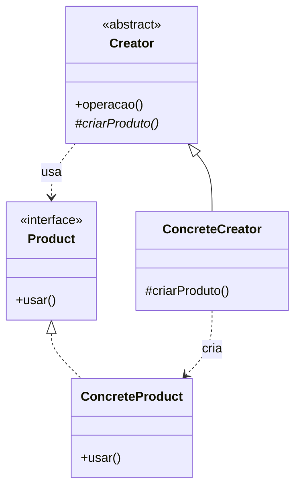

<!--
  Esqueleto a preencher. Apague os comentários HTML (como este) conforme escrever.

  ESPINHA DA PÁGINA — a frase que todas as seções defendem:

    O Factory Method não elimina a decisão de qual classe instanciar — ele a
    move para quem escolhe o criador. E só se paga quando o criador já existia
    por outro motivo.

  Duas seções fogem do templates/pattern.md, de propósito:

    · "Aviso de nome" (logo abaixo do título) — o leitor chega achando que já
      usa o pattern. Se ele não for desarmado na primeira tela, lê a página
      inteira encaixando tudo no switch que já tem na cabeça.

    · "Não confunda" (antes da Implementação) — é o maior valor da página.
      Fica no meio: depois que o leitor sabe o que é a coisa certa, e antes
      de ver código.

  Regra de ouro do repositório: "Quando NÃO usar" e "Trade-offs" são as
  seções que dão valor real. Enquanto estiverem vazias, o mapa no README
  raiz mantém 🔜/🚧.
-->

# Factory Method

<!-- Uma frase dizendo o que o pattern faz. Sem jargão, sem "encapsula a
     variação de..." — a frase que você usaria explicando pra alguém no café.

     Cuidado para a frase não descrever Simple Factory, que é o erro que a
     página inteira existe para corrigir. -->

> [!WARNING]
> <!-- 2 a 4 linhas, sem tabela — a tabela é a seção "Não confunda", lá embaixo.
>      O recado: se o que você chama de "factory" tem um switch sobre um
>      parâmetro de tipo, você vai encontrar aqui o nome certo para isso, e
>      não é este pattern. Sem tom de correção; o leitor não está errado, o
>      nome é que é sobrecarregado. -->

---

## O problema

<!-- Comece pela dor, não pela solução.

     O cenário que sustenta o pattern (é o do próprio GoF: Application cria
     Document) é o de FRAMEWORK/BIBLIOTECA: você escreve uma classe cujo
     algoritmo está pronto e correto, e há UMA linha `new X()` travada no
     meio dele. Você não pode escrever um switch sobre classes que ainda não
     existem — quem vai criá-las é quem instalar seu código.

     Mostrar o código ruim aqui vale muito: a classe inteira boa, com a única
     linha problemática destacada.

     As três saídas, para o leitor ver por que as duas primeiras não servem:
       1. duplicar a classe          -> 40 linhas copiadas por causa de 1
       2. receber o tipo e dar switch -> a base passa a conhecer todo subtipo
       3. transformar a linha num buraco -> o pattern

     Fonte: GoF (1994), p. 107 — o exemplo motivador do livro é um framework,
     não código de aplicação. Isso não é detalhe: é o argumento. -->

## A ideia

<!-- A solução em 3–4 frases. O movimento central: a linha `new X()` vira um
     método abstrato que a subclasse preenche. O algoritmo da base é escrito
     uma vez e nunca mais é tocado.

     Vale bater no ponto que mais gera "não entendi": NÃO EXISTE uma classe
     XFactory aqui. O "factory" é um método solto dentro de uma classe que faz
     outra coisa. É literalmente o nome: método fábrica, não classe fábrica. -->

## Estrutura

<!-- O diagrama precisa mostrar as DUAS hierarquias paralelas lado a lado —
     é isso que distingue o pattern e o que o GoF chama de "parallel class
     hierarchies". Um Creator sozinho não comunica nada.

     Repare que a seta que importa é a pontilhada: ConcreteCreator cria
     ConcreteProduct, e é a única ligação entre as duas hierarquias. -->



## Participantes

<!-- Uma linha cada. O `Creator` é o que costuma ser mal explicado: ele NÃO
     é uma fábrica, é a classe que tem o algoritmo e que por acaso precisa
     criar algo no meio dele. -->

| Papel | Responsabilidade |
| --- | --- |
| `Creator` | |
| `ConcreteCreator` | |
| `Product` | |
| `ConcreteProduct` | |

## Não confunda

<!-- ESTA É A SEÇÃO QUE JUSTIFICA A PÁGINA EXISTIR. Quatro coisas diferentes
     carregam a palavra "factory" e só uma é este pattern.

     Sugestão de régua para fechar a seção, se concordar com ela:

       Se existe um switch/if sobre um parâmetro de tipo -> Simple Factory.
       Se a escolha está em QUAL subclasse do criador foi instanciada -> Factory Method.

     Fontes por linha:
       · Simple Factory       — Head First Design Patterns batiza o termo e
                                avisa que não é pattern do GoF
       · static factory method — Effective Java, Item 1. Bloch alerta que não
                                é o Factory Method do GoF. Convenções de nome:
                                of, valueOf, getInstance, newInstance, create
       · Factory Method       — GoF p. 107
       · Abstract Factory     — GoF. A régua do Head First:
                                Factory Method usa herança,
                                Abstract Factory usa composição -->

| Nome | O que é | Onde mora a decisão | É pattern do GoF? |
| --- | --- | --- | --- |
| Simple Factory | | | |
| Static factory method | | | |
| **Factory Method** | | | |
| Abstract Factory | | | |

<!-- Fecha com o teste de bolso, em uma linha destacada. -->

## Implementação

<!-- Um bloco <details> por linguagem. É o substituto de "abas" no Markdown
     puro: a página não fica gigante com três implementações abertas.

     Deixe INLINE apenas o núcleo do pattern (~20–30 linhas). O setup, o main
     e os prints ficam só no arquivo executável.

     SUGESTÃO DE EIXO — em vez de as três linguagens fazerem a mesma coisa,
     use a diferença entre elas como argumento:

       · Java       — o Factory Method clássico, com herança. É onde ele nasceu
                      e onde ainda é a saída natural.
       · TypeScript — a versão com herança e, ao lado, o que ela vira quando
                      há função de primeira classe: um `criar: () => Produto`
                      recebido por parâmetro.
       · Python     — idem, e aqui a biblioteca padrão prova os dois lados:
                      logging.Handler.createLock() é Factory Method de verdade
                      (o __init__ chama self.createLock(); NullHandler
                      sobrescreve para não criar lock nenhum), enquanto
                      json.loads(parse_float=Decimal) resolve o mesmo problema
                      passando a fábrica como parâmetro.

     Assim a página PROVA a tese em vez de citá-la. Confere com:
       python3 -c "import inspect, logging; print(inspect.getsource(logging.Handler.createLock))"

     Restrição do repositório para o .ts: sem enum, sem namespace, sem
     decorators e sem parameter properties (`constructor(private x: T)`).

     Os arquivos executáveis ainda NÃO existem — por isso os links abaixo
     seguem com o placeholder <seção>/<tópico>. Ao criar os três main.*,
     troque por patterns/criacionais/factory-method. Se decidir que o tópico
     não precisa de exemplo, apague a seção inteira. -->

<details>
<summary><b>TypeScript</b></summary>

```ts
// núcleo do pattern
```

▸ [Exemplo completo e executável](https://github.com/JoaoVitorLima242/project-patterns/blob/main/docs/<seção>/<tópico>/typescript/main.ts)

</details>

<details>
<summary><b>Python</b></summary>

```python
# núcleo do pattern
```

▸ [Exemplo completo e executável](https://github.com/JoaoVitorLima242/project-patterns/blob/main/docs/<seção>/<tópico>/python/main.py)

</details>

<details>
<summary><b>Java</b></summary>

```java
// núcleo do pattern
```

▸ [Exemplo completo e executável](https://github.com/JoaoVitorLima242/project-patterns/blob/main/docs/<seção>/<tópico>/java/Main.java)

</details>

## Onde ele aparece de verdade

<!-- Seção opcional, mas ela sozinha derruba a objeção "isso é acadêmico".
     Não existe artigo do tipo "o Factory Method salvou nosso sistema" — o
     pattern vive em código de framework, e por isso a evidência está no
     fonte das bibliotecas, não em blog. Os casos verificados:

       · Collection.iterator() (Java) — o melhor para abrir, porque todo mundo
         usa todo dia sem saber. ArrayList e HashSet devolvem iteradores
         diferentes; o for-each nunca sabe qual chegou. Metsker dedica um
         capítulo a isso.
       · logging.Handler.createLock() (Python) — o mais curto e o único que o
         leitor pode rodar sem instalar nada.
       · IDbCommand.CreateParameter (ADO.NET) — hierarquias paralelas em estado
         puro: SqlCommand cria SqlParameter, OracleCommand cria OracleParameter.
       · QMainWindow::createPopupMenu (Qt) — ponto de extensão de framework.

     E um que NÃO conta, apesar de aparecer em toda lista da internet:
     DocumentBuilderFactory.newInstance(). É método estático que resolve por
     service loader, sem criador com subclasse. Vale citar como armadilha. -->

## Quando usar

<!-- Sinais concretos no código, não adjetivos. "Quando você tem várias formas
     de fazer X e escolhe entre elas em runtime" é melhor que "quando quer
     flexibilidade".

     Os candidatos que sobraram da discussão:
       · você escreve a classe base e NÃO PODE conhecer as subclasses (é
         biblioteca, framework, plugin)
       · o criador já existe por outro motivo e já tem algoritmo próprio —
         criar o objeto é só um passo dele
       · duas hierarquias que precisam andar juntas (Comando/Parâmetro,
         Coleção/Iterador)

     Fowler, em Refactoring, tem o verbete "Replace Constructor with Factory
     Method" com a mecânica passo a passo, se quiser dar um gatilho acionável. -->

- 
- 

## Quando NÃO usar

<!-- A seção mais importante. O material que saiu da discussão:

       · A factory não escolhe classe, só valida invariante (h <= 500). Isso é
         trabalho do CONSTRUTOR — guard clause. Factory que não escolhe classe
         é construtor com um passo a mais. E se o construtor deixa nascer
         objeto inválido, factory nenhuma conserta: sempre dá para chamar
         `new` direto e furar a regra.
       · Você já tem o objeto polimórfico em mãos. Aí `objeto.fazer()` basta —
         redescobrir o tipo com instanceof é jogar o polimorfismo fora e
         comprá-lo de volta mais caro. A régua: factory vive na FRONTEIRA,
         onde dado vira objeto. Dentro do domínio, polimorfismo resolve.
       · Um parâmetro ou um mapa de tipo->construtor resolveria. O mapa fecha
         para modificação em quatro linhas, sem herança nenhuma.
       · O criador só existe para hospedar o método de criação. Aí você montou
         uma hierarquia inteira para não escrever um switch de três linhas —
         e a decisão nem sumiu, só subiu de andar (alguém ainda escolhe qual
         ConcreteCreator instanciar).

     Vale separar "não é o pattern certo" de "não é pattern nenhum, e tudo
     bem" — Simple Factory resolve a maioria dos casos reais e não é erro.

     Evans (DDD, cap. 6) sustenta a primeira: a criação sai do objeto quando
     montar um agregado consistente fica complicado ou expõe a estrutura
     interna. Antes disso, o construtor dá conta. -->

- 
- 

## Trade-offs

<!-- Todo pattern cobra. Os custos que apareceram:
       · uma subclasse de criador por variação de produto
       · duas hierarquias paralelas que precisam evoluir juntas — produto novo,
         classe nova dos dois lados
       · exige herança, com tudo que ela cobra (ver Composição vs. Herança)
       · a decisão não some, muda de lugar
       · se o criador sorteia/gera valores, ele virou gerador — e aleatoriedade
         escondida lá dentro é um inferno de testar (não dá para pedir "me dá
         um de 300x200"). A saída é a fonte de aleatoriedade entrar como
         dependência, não nascer no construtor. -->

| Ganha | Paga |
| --- | --- |
|  |  |

## Patterns relacionados

<!-- Diga a DIFERENÇA, não só o nome — é o que resolve a confusão entre
     patterns de estrutura parecida.

     Convenção do repositório: tópico ainda 🔜 fica em negrito SEM link (a
     pasta não existe, o link daria 404). Quando cada um for escrito, volte
     aqui e converta em link. -->

- **Template Method** — <!-- o parentesco mais próximo: `criarProduto()` é um
  gancho de um algoritmo fixo da base, e o Factory Method é o gancho que por
  acaso devolve um objeto. -->
- **Abstract Factory** — <!-- um produto por herança × família de produtos que
  variam juntos, por composição. É a fronteira que mais confunde. -->
- **Builder** — <!-- monta um objeto complexo passo a passo × escolhe qual
  classe instanciar. -->
- **Strategy** — <!-- quando a fábrica vira parâmetro em vez de subclasse, é
  literalmente uma Strategy de construção. -->
- [**Polimorfismo**](https://github.com/JoaoVitorLima242/project-patterns/tree/main/docs/principios/polymorphism) — <!-- a factory escolhe, o polimorfismo executa. Sem interface comum no produto, a factory não entrega nada. -->
- [**Composição vs. Herança**](https://github.com/JoaoVitorLima242/project-patterns/tree/main/docs/principios/composition-vs-inheritance) — <!-- o pattern exige herança; a alternativa por parâmetro é a mesma decisão desta página. -->
- [**Open/Closed (OCP)**](https://github.com/JoaoVitorLima242/project-patterns/tree/main/docs/principios/ocp) — <!-- Simple Factory viola (edita o switch), Factory Method fecha (adiciona subclasse). É a diferença mais concreta entre os dois. -->
- [**Dependency Inversion (DIP)**](https://github.com/JoaoVitorLima242/project-patterns/tree/main/docs/principios/dip) — <!-- o Creator depende de Product (abstração), nunca de ConcreteProduct. -->

## Referências

<!-- Ordem sugerida: a definição primeiro, depois quem ensina melhor, depois a
     dissidência. Complete com edição/página conforme for citando. -->

- **Design Patterns** — Gamma, Helm, Johnson, Vlissides (1994), p. 107. <!-- a definição original e o termo "hierarquias de classes paralelas" -->
- **Head First Design Patterns** — Freeman & Robson. <!-- evolui o mesmo exemplo em Simple Factory -> Factory Method -> Abstract Factory; é o livro que resolve a confusão de nome -->
- **Effective Java** — Joshua Bloch, Item 1. <!-- avisa explicitamente que static factory method NÃO é o Factory Method do GoF -->
- **Domain-Driven Design** — Eric Evans, cap. 6 ("Factories"). <!-- quando a criação sai do objeto: agregado consistente, invariante, factory × repository -->
- **Refactoring** — Martin Fowler. <!-- verbete "Replace Constructor with Factory Method" -->
- **Design Patterns Java Workbook** — Steve Metsker. <!-- o capítulo sobre iterator() como Factory Method clássico -->
- [The Factory Method Pattern](https://python-patterns.guide/gang-of-four/factory-method/) — Brandon Rhodes. <!-- a dissidência: o pattern como muleta de linguagem sem função de primeira classe -->
- [Factory Comparison](https://refactoring.guru/design-patterns/factory-comparison) — Refactoring Guru. <!-- a taxonomia dos seis termos, útil para a seção "Não confunda" -->
