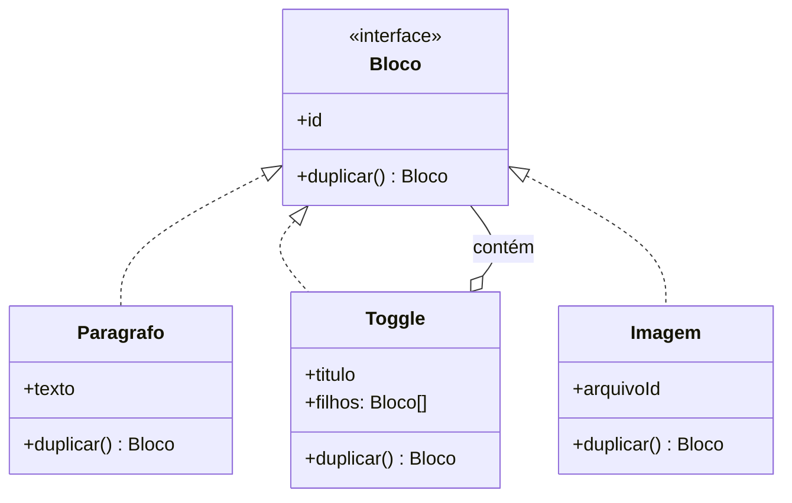

# Rascunho — Prototype

> **Este arquivo não é a página.** É material bruto: o raciocínio da conversa
> organizado para não se perder, com os pontos que ainda precisam da sua decisão.
> A prosa da página (`README.md`) é escrita por você depois, em cima disto.
>
> **Apagar antes de abrir o PR.**

Estado: branch `docs/prototype`, `README.md` = template ainda em branco.
Mapa do README raiz: Prototype continua `🔜`.

---

## 1. O que o pattern é, cru

Em vez de criar um objeto com `new`, você pega um objeto **que já existe** e pede
que ele faça uma cópia de si mesmo: `objeto.clone()`.

O mecanismo é banal. O que interessa é *por que* alguém criaria objetos assim.

Correção importante de leitura do diagrama do GoF:

```
Prototype (interface)  ←  Produto, Bloco, Forma
     + clone()
```

**O pattern não cria classe nova.** `Produto` já existe. Ele coloca **um método**
numa classe que você já tem. O único participante realmente novo é o *registry*,
e ele é opcional. A decisão real é bem menor do que o diagrama sugere:

```
duplicarProduto(produto)      // lógica de cópia FORA, num service  → função
produto.duplicar()            // lógica de cópia DENTRO, no objeto  → método
```

## 2. Três dores diferentes chegam com o mesmo nome

Mesma armadilha do Builder — vale separar antes de qualquer coisa.

**(a) A dor do GoF: uma subclasse por configuração.**
Exemplo do livro: editor de partitura. Uma subclasse de `Tool` para colcheia,
semínima, pausa, clave. Mas nenhuma delas tem comportamento diferente — diferem
só em *qual símbolo*. É hierarquia de classes usada para guardar valores.

Prototype colapsa isso: **um** `GraphicTool`, que recebe um objeto-modelo e clona.

> Prototype troca **subclasses por instâncias**. Quando a variação é estado e não
> comportamento, ela não deveria estar no sistema de tipos.

Consequência forte: com Factory Method você adiciona um tipo escrevendo código e
recompilando. Com Prototype você adiciona **registrando mais um objeto** — em
runtime, vindo de arquivo, banco ou do usuário. É o único criacional do GoF em que
o conjunto de "tipos" é aberto em tempo de execução.

**(b) A dor prática: o objeto é caro de construir.**
Veio de parse pesado, query, cálculo. Clonar custa menos que reconstruir.
É a justificativa mais citada em tutorial — e a mais fraca, porque é otimização,
não design.

**(c) A dor polimórfica: copiar sem saber a classe concreta.**
Você tem uma referência do tipo `Forma`. `new Forma()` não existe e você não sabe
se por baixo é `Circulo` ou `Grupo`. **Só o objeto sabe se copiar** — por isso
`clone()` fica na interface.

## 3. O caminho da conversa (a ordem em que o raciocínio andou)

Vale registrar porque a página provavelmente segue esse mesmo arco:

1. **Editor gráfico (Figma).** Usuário salva um estilo "Card" e arrasta da barra
   lateral. Subclasse `Card extends Retangulo` não serve por dois motivos: ela não
   tem comportamento, e **quem cria o Card é o usuário, depois do deploy** — não
   existe compilação em runtime. O estilo vira um *objeto guardado num Map*, e
   arrastar = clonar. Cinquenta estilos = cinquenta entradas no mapa e **uma** classe.
2. **"Mas por que não `new Retangulo(mesmos valores)`?"** Duas respostas: (i) quem
   copia de fora precisa conhecer todos os campos, inclusive os privados — campo
   novo entra e o clone sai incompleto, silenciosamente; (ii) quando o modelo é uma
   `Forma` e pode ser `Retangulo`, `Texto` ou `Grupo`, você cai num `if/else` sobre
   `instanceof`, que é o cheiro clássico de polimorfismo faltando.
3. **"E em API?"** O botão **"Duplicar"** — campanha, produto, formulário, fluxo.
   Ninguém chama de pattern; chamam de "a rota de duplicar".
4. **"Mas por que criar classe só pra duplicar?"** ← a objeção certa. Resposta
   honesta: **não deve.** Na maioria do código de API, uma função no service é o
   design correto. Isso não é etapa até entender — é a conclusão.

## 4. Tese candidata

⚠️ **Sua decisão.** Registrando o que a conversa apontou, não como texto final:

> Prototype é o pattern que **quase todo mundo deve resolver com uma função**, e
> as duas situações em que não deve.

Ou, na versão de API:

> Em código de API, Prototype não é sobre copiar um objeto. É sobre responder
> **o que "mais um igual a este" significa no domínio** — e essa resposta é
> diferente campo por campo, então não pode ser gerada automaticamente.

Casa com o que o Builder já faz (terminar dizendo em que linguagem/situação o
pattern nem nasce). Se ficar assim, a página não é "como implementar Prototype".

## 5. A régua: função ou método?

O que o método `clone()` compra é **uma coisa só**: copiar algo **sem saber o que é**.

```ts
function duplicar(coisa) {
  return coisa.duplicar()   // qualquer coisa, sem if
}
```

Se você **sempre sabe** que está segurando um `Produto`, isso não compra nada —
`duplicarProduto(p)` é melhor: mais simples, testável sozinha, e não põe
responsabilidade de persistência dentro da entidade.

Teste na ordem, parar no primeiro "sim":

| # | Situação | Resposta |
| --- | --- | --- |
| 1 | Um tipo só, e quem chama sabe qual é | Função no service. **~90% do código de API** |
| 2 | Poucos tipos, conjunto fechado, quem chama sabe qual é | Uma função por tipo. Ainda sem pattern |
| 3 | Cópia **recursiva** sobre tipos heterogêneos | Método no objeto — a recursão precisa do polimorfismo |
| 4 | Conjunto de tipos **cresce**, ou quem chama recebe por interface | Método no objeto, pelo argumento do OCP |

Detalhe que fecha o item 3: numa árvore, `duplicar()` em cada nó **se chama sozinho
nos filhos** sem saber o que eles são. Numa função externa, essa recursão só existe
passando por um `switch` a cada nível.

## 6. O exemplo do Notion — aprofundado

> Este é o cenário que você pediu para entender melhor. É o caso onde a função
> genuinamente quebra, e serve de contraste direto com o "duplicar produto".

### O domínio

Uma página do Notion é uma **árvore de blocos**: parágrafo, título, tabela, imagem,
embed, toggle, coluna, sub-página. E blocos contêm blocos, recursivamente.



O `Toggle o-- Bloco` é o ponto: a estrutura é um [Composite], e é ele que torna a
recursão inevitável.

### Por que a função quebra aqui

```ts
function duplicarBloco(bloco: Bloco): Bloco {
  switch (bloco.tipo) {
    case 'paragrafo': return { ...bloco, id: novoId() }
    case 'imagem':    return { ...bloco, id: novoId(), arquivoId: bloco.arquivoId }
    case 'tabela':    return { ...bloco, id: novoId(), linhas: bloco.linhas.map(duplicarLinha) }
    case 'toggle':    return { ...bloco, id: novoId(), filhos: bloco.filhos.map(duplicarBloco) }
    case 'subpagina': // ...
    case 'embed':     // ...
    // e mais 30
  }
}
```

Três problemas, e o terceiro é o que mata:

1. O `switch` cresce sem parar e vira o lugar mais perigoso do sistema.
2. Ele precisa conhecer os campos internos de **todo** tipo de bloco — o
   encapsulamento de trinta classes vaza para dentro de uma função.
3. **Todo bloco novo obriga a editar essa função.** O time adiciona "bloco de
   código", esquece do `switch`, e o bloco **some ao duplicar a página**. Ninguém
   descobre até um cliente reclamar.

O item 3 é literalmente [OCP]: o comportamento varia por tipo, então cada tipo traz
a própria resposta. Com o método no objeto, o bloco de código **nasce sabendo se
duplicar**, e a função de duplicar página nunca é tocada:

```ts
paginaRaiz.duplicar()   // recursivo, e o switch não existe
```

E continuam sendo as mesmas trinta classes de bloco que já existiam.
**Nenhuma classe nova.**

### Como aplicar de verdade — o esqueleto

```ts
interface Bloco {
  duplicar(): Bloco          // não recebe nada, não sabe quem chamou
}

class Paragrafo implements Bloco {
  constructor(private id: string, private texto: RichText) {}

  duplicar(): Bloco {
    return new Paragrafo(novoId(), this.texto)     // id novo, conteúdo copiado
  }
}

class Toggle implements Bloco {
  constructor(private id: string, private titulo: RichText, private filhos: Bloco[]) {}

  duplicar(): Bloco {
    return new Toggle(
      novoId(),
      this.titulo,
      this.filhos.map(f => f.duplicar()),   // ← a recursão, sem saber o que são os filhos
    )
  }
}

class Imagem implements Bloco {
  constructor(private id: string, private arquivoId: string) {}

  duplicar(): Bloco {
    return new Imagem(novoId(), this.arquivoId)    // COMPARTILHA o arquivo no S3
  }
}
```

Repare em três coisas:

- `Toggle.duplicar()` chama `f.duplicar()` sem nenhum `if`. Ele não sabe se o filho
  é parágrafo, tabela ou outro toggle. **É esse o ganho, e é o único.**
- Cada classe decide sozinha o que é identidade e o que é conteúdo.
- `Imagem` não copia o binário — compartilha o `arquivoId`. Decisão de domínio, e
  ela está escrita **no lugar onde alguém que mexe em imagem vai olhar**.

### As decisões campo a campo, em termos de Notion

| O que | Decisão | Por quê |
| --- | --- | --- |
| `id` do bloco | **novo, sempre** | identidade, não conteúdo |
| texto / rich text | copia | conteúdo |
| filhos | **duplica recursivo** | são parte do bloco |
| arquivo de imagem (S3) | **compartilha o `arquivoId`** | duplicar o binário custa caro e não muda nada |
| menção a usuário (`@joao`) | compartilha a referência | não existe "um segundo João" |
| link para outra página | ❓ compartilha ou duplica? | **o Notion real pergunta ao usuário** — "duplicate with subpages" |
| comentários | **não vêm junto** | pertencem ao bloco original |
| `createdBy` / `createdAt` | novos | metadado do registro novo |

A linha do "link para outra página" é a mais interessante: é uma decisão que **nem o
Notion conseguiu tomar sozinho** — virou uma opção na UI. Bom material para a seção
de trade-offs.

### ❓ Ponto prático a resolver: e a persistência?

`duplicar()` como método da entidade é limpo enquanto for **puro** (monta a árvore
nova em memória, não toca no banco). Se ele salvar, a entidade passa a conhecer
repositório/transação e vira outra coisa.

Desenho que parece certo, **a validar**:

```ts
const copia = pagina.duplicar()        // puro: árvore nova em memória, ids novos
await repo.salvarArvore(copia)         // o repositório percorre e persiste
```

Assim o pattern fica só na parte de domínio, e a parte de infra (transação,
batch insert, ordem de inserção pai→filho) fica de fora. Precisa checar se isso
aguenta uma página com 5 mil blocos ou se vira problema de memória — o que
reabriria o argumento do Builder com Director (streaming).

## 7. O contraste: "duplicar produto" — onde a função basta

Rota que todo SaaS tem: `POST /api/products/:id/duplicate`.

```ts
const copia = { ...original }   // parece que acabou. não acabou.
```

Campo por campo, e **cada linha é uma decisão de negócio**:

| Campo | Copia? | Por quê |
| --- | --- | --- |
| `id` | não — gera novo | identidade |
| `sku` | não | tem `unique` no banco; a rota estoura |
| `nome` | copia + `" (cópia)"` | senão o usuário não distingue na lista |
| `status` | não — volta pra `rascunho` | duplicar não pode publicar sozinho |
| `createdAt` / `updatedAt` | não | metadado do registro novo |
| `categoriaId` | **copia a referência** | categoria é compartilhada, não duplicada |
| `imagens` | ❓ depende | mesmos arquivos no S3, ou copia os binários? |
| `variantes` | **cópia profunda** (linhas novas) | são conteúdo do produto |
| `avaliações` | **nunca** | pertencem ao produto original |
| `estoque` | zera | estoque é do item físico |

**Isto é a discussão de cópia rasa × profunda vestida de regra de negócio.**
`categoriaId` = referência compartilhada. `variantes` = cópia profunda.
`avaliações` = nem uma coisa nem outra, não vem junto.

E o `{ ...original }` erra em **todas** essas linhas, silenciosamente. É por isso
que a rota de duplicar é gerador clássico de bug: o produto sai publicado, com o
estoque do outro, e com um SKU que derruba a request.

**Mesmo assim, aqui a resposta é função.** Um tipo só, quem chama sabe qual é
(caso 1 da régua). O valor do pattern neste caso é só o *nome da decisão*.

## 8. Cópia rasa × profunda

O erro real que o pattern esconde.

```ts
class Grupo {
  clone() { return new Grupo(this.filhos) }   // ⚠️ mesmas referências
}

const copia = card.clone()
copia.filhos[0].cor = "vermelho"   // o Card ORIGINAL ficou vermelho
```

Conserto — cada filho se clona (e funciona porque `clone()` está na interface):

```ts
clone() { return new Grupo(this.filhos.map(f => f.clone())) }
```

**Mas "profunda em tudo" também está errado.** Se o objeto tem `autor: Usuario`,
clonar o usuário junto é um bug pior — você criou um segundo João no sistema.

> Ao escrever `clone()`, você decide **campo por campo** o que é conteúdo (copia) e
> o que é identidade (compartilha). Não existe resposta automática — por isso
> `clone()` gerado por ferramenta quase sempre está errado.

## 9. Linguagens: a mecânica ficou grátis, o design não

| Linguagem | Como se copia hoje |
| --- | --- |
| JavaScript / TS | `structuredClone(obj)`, spread `{...obj, x: 1}` |
| Python | `copy.deepcopy(obj)`, `dataclasses.replace(obj, x=1)` |
| Kotlin / C# | `obj.copy(x = 1)` / `obj with { X = 1 }` |
| Java 16+ | records — mas **sem `with`**, ainda dói |

Se o problema era "copiar mudando um campo", a linguagem resolve. Não tem pattern.

O que `structuredClone` **não** dá: a decisão de que o catálogo de tipos vira um
catálogo de objetos, e a decisão campo-a-campo do que é identidade.

Curiosidade: **JavaScript não tem esse pattern porque ele *é* o pattern.** Objeto
herda de objeto via protótipo; `Object.create(base)` é a operação nativa. `class`
em JS é açúcar por cima disso.

### O `Cloneable` do Java — caso de estudo à parte

Raro um mecanismo de linguagem ser tão publicamente condenado:

- `Cloneable` é uma interface **vazia** — não declara `clone()`. Ela só muda o
  comportamento de um método herdado de `Object`.
- `Object.clone()` é `protected`, então não dá para chamar pela interface.
  **A interface não te dá o método que dá nome a ela.**
- Cria o objeto **sem passar pelo construtor** — fura qualquer invariante.
- Não funciona com campo `final`: não dá para reatribuir, logo não dá para
  consertar a cópia rasa.

Bloch (*Effective Java*, Item 13 na 3ª ed. — ❓ conferir, era Item 11 na 2ª):
prefira **construtor de cópia** (`new Pedido(outro)`) ou **factory de cópia**
(`Pedido.copiarDe(outro)`).

Tese possível daqui: **o mecanismo está desacreditado, o pattern não.** Construtor
de cópia continua sendo Prototype — mesma ideia, outra sintaxe.

## 10. O contraponto forte (candidato ao coração do "Quando NÃO usar")

**Prototype é um pattern de um mundo mutável.**

Todo o valor dele pressupõe que você quer uma cópia *porque vai modificá-la sem
afetar o original*. Se o objeto é imutável, o problema não existe: compartilha a
referência, e "copiar mudando um campo" é `with`/`replace`, que é linguagem.

Na direção para onde o design moderno andou — imutabilidade, value objects,
records — o Prototype perde a maior parte do terreno. Sobra o registry e a ideia de
variação-como-dado. Bem menos do que ele ocupava em 1994.

## 11. Onde ele aparece de verdade

- **Botão "Duplicar"** de qualquer SaaS — campanha, produto, formulário, fluxo.
- **`PodTemplate` do Kubernetes** — o Deployment guarda um pod-modelo e cria
  réplicas clonando. `replicas: 3` é "clone o protótipo três vezes". Registry de
  protótipo em escala industrial.
- **Template persistido que gera instâncias** — contrato, e-mail, assinatura
  recorrente que gera um pedido por mês, checklist. O ponto: **quem cria "tipos
  novos" é o usuário editando um registro.** Se fosse classe, todo template novo
  seria um deploy.
- **Dados de teste** — `{ ...pedidoBase, status: 'CANCELADO' }`. Mesmo ganho que
  você já argumentou no Builder (o teste declara só o que importa), com a diferença
  de partir de um objeto pronto em vez de montar do zero. E a mesma pegadinha, com
  força: spread é raso, então `pedido.itens.push(...)` **vaza para os outros
  testes** — causa clássica do teste que passa sozinho e quebra na suíte.
- **Config base + override** — `{ ...configPadrao, ...overridesDoTenant }`.
  Prototype no sentido fraco: a mecânica sem o desenho.
- **Motor de jogo** — `goblin.json` carregado no início vira objeto-modelo, clonado
  a cada spawn. ⚠️ o motivo forte **não** é "é caro de construir", é que **o
  designer edita o arquivo sem chamar o dev**. Mesmo motivo do produto no Postgres;
  só muda onde o modelo está guardado.

## 12. Matéria-prima para "Quando NÃO usar"

- **Response de request comum.** Monta um DTO novo por request. Não há protótipo,
  não há catálogo. Usar Prototype aí é inventar problema.
- **Entidade que nasce de um POST.** Os dados vêm de fora; não existe modelo prévio.
- **Objeto imutável.** "Cópia" e "referência" são a mesma coisa na prática.
- **Um tipo só e quem chama sabe qual é.** Função. É o caso mais frequente.
- **Linguagem com `copy`/`with`/spread**, se o problema era só trocar um campo.
- ❓ Confusão com Factory Method: lá o conjunto é fechado em compile time; aqui é
  aberto em runtime.

Gatilho positivo, para a seção "Quando usar":

> Vale olhar para Prototype quando **existe um objeto de referência guardado** (no
> banco, num `Map`, num arquivo) **e você produz novos a partir dele** — e
> principalmente quando quem define esses modelos é o usuário, não o deploy.

Se não há um "modelo salvo", não é este pattern.

## 13. Como ele se encaixa nos que já estão escritos

Mesma cena (o editor), três patterns, três perguntas:

| | Pergunta que responde |
| --- | --- |
| **Factory Method** | Qual classe instanciar? |
| **Builder** | Como montar passo a passo? |
| **Prototype** | Como conseguir mais um **igual a este**? |

Diferença de fundo: **Factory Method e Builder partem do nada**, e o conjunto de
coisas possíveis está fixado no código. **Prototype parte de algo que já existe**, e
o conjunto de coisas possíveis é o conteúdo de uma coleção que cresce em runtime.

### Ganchos que já existem no repositório e viram link quando esta página sair

- `docs/patterns/criacionais/builder/README.md:380` — "clonar um objeto pronto e
  ajustar × montar do zero passo a passo. Quando as variações são pequenas sobre uma
  base comum, clonar costuma custar menos." (hoje em negrito, sem link)
- `docs/patterns/criacionais/abstract-factory/README.md:327` — a fábrica que guarda
  protótipos e clona, evitando explosão de subclasses. **É o prototype registry**, e
  fecha as duas páginas.
- `docs/patterns/criacionais/abstract-factory/README.md:336` — a referência ao GoF
  p. 87 já menciona "fábricas baseadas em Prototype".

Links a fazer **de** esta página: [OCP] (o argumento do bloco novo esquecido no
switch), [Polimorfismo] (só o objeto sabe se copiar — mesmo raciocínio aplicado à
criação), **Composite** (a árvore de blocos; ainda `🔜`, então fica texto puro),
[Encapsulamento] (copiar de fora exige conhecer campos privados), [Builder].

## 14. ❓ Pontos a validar — o que falta decidir

1. **Qual a espinha da página?** Três candidatas na mesa:
   - (a) "subclasses viram instâncias" — a mais conceitual, a mais fiel ao GoF
   - (b) "o mecanismo morreu, o desenho não" — o arco `Cloneable` → construtor de
     cópia → `structuredClone`
   - (c) "quase sempre é uma função, e as duas situações em que não é" — a que saiu
     da conversa e a que dá o melhor "Quando NÃO usar"
2. **Cenário de abertura: Notion ou "duplicar produto"?** O produto é o que o leitor
   vive e já tem a tabela campo-a-campo pronta; o Notion é onde a função quebra de
   verdade. Talvez os dois, nessa ordem — produto para mostrar que função basta,
   Notion para mostrar onde não basta.
3. **Cópia rasa × profunda: seção própria ou diluída?** Inclinação: própria, porque
   é onde o bug mora — mas quem decide é você.
4. **Vale a pena manter o exemplo do GoF (editor de partitura)?** Ele explica a
   origem, mas é datado. Alternativa: citar só na seção de referências.
5. **Persistência no exemplo do Notion** — confirmar o desenho `duplicar()` puro +
   `repo.salvarArvore()`, e checar se aguenta árvore grande (ver seção 6).
6. **Exemplo executável nas três linguagens?** Se sim, o Notion é o melhor candidato
   — a recursão em árvore é o que justifica o pattern, e em Java daria para mostrar
   o contraste `Cloneable` × construtor de cópia. Se não, a página vive com trechos
   inline. **Sua decisão** (regra do repositório: três ou nenhuma).
7. **Conferir:** GoF p. 117 (❓ confirmar página do Prototype) e o número do Item do
   Bloch por edição.

## 15. Referências a conferir

- **Design Patterns** — GoF (1994), Prototype. ❓ conferir página. O editor de
  partitura (`GraphicTool` + protótipo) e a nota sobre *prototype manager* (registry).
- **Effective Java** — Bloch, Item 13 (3ª ed.), "Override clone judiciously".
  Por que `Cloneable` é quebrado e por que construtor de cópia é melhor.
- [Prototype](https://refactoring.guru/design-patterns/prototype) — Refactoring Guru.
  Estrutura desenhada e o *prototype registry*.
- ❓ Procurar: algo do Brandon Rhodes sobre Prototype em Python
  (`python-patterns.guide`) — ele tem uma leitura boa sobre patterns que somem na
  linguagem, e serviu bem na página do Builder.
- ❓ Documentação do Kubernetes sobre `PodTemplate` — para o exemplo real de registry.
- ❓ Notion API / docs sobre duplicação de página com sub-páginas — confirmar que a
  escolha "duplicate with subpages" existe mesmo na UI antes de afirmar isso.
