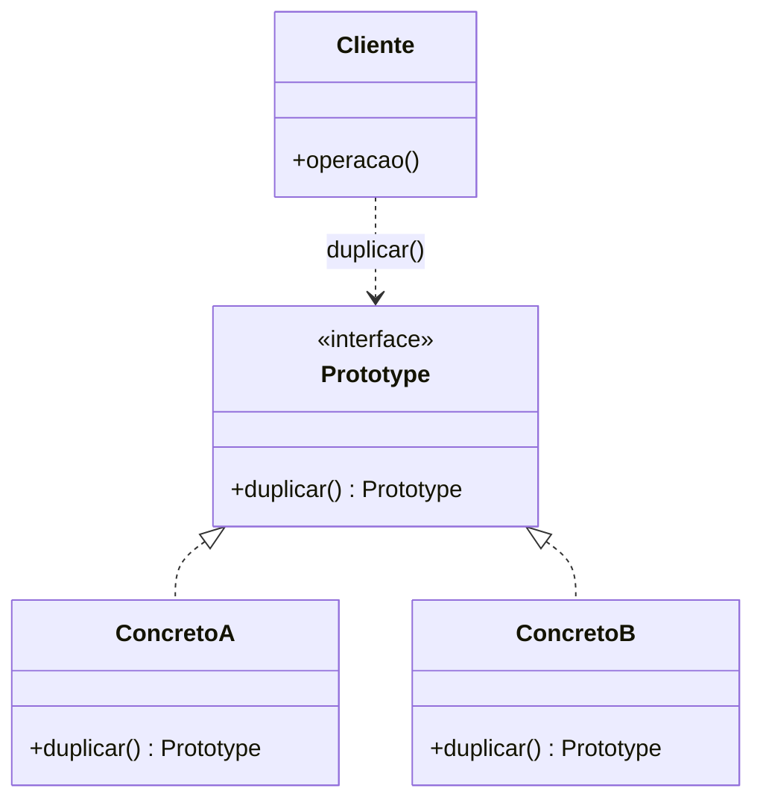
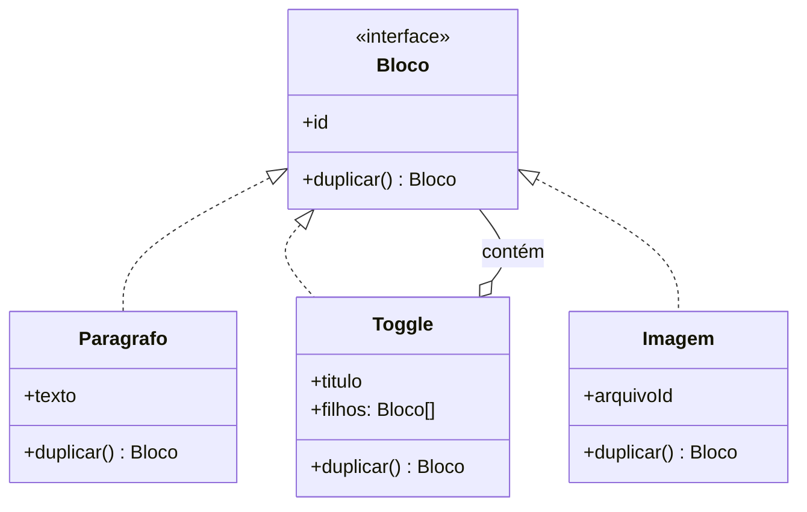

# Prototype

Em vez de construir um objeto do zero, você pede a um objeto que já existe uma cópia de si mesmo.

O mecanismo é banal — e é por isso que quase todo texto sobre este pattern erra o alvo. O trabalho de verdade não é copiar; é decidir o que "uma cópia" significa.

---

## O problema

Todo SaaS tem o menuzinho de três pontinhos com **"Duplicar"**. Duplicar campanha, duplicar produto, duplicar formulário, repetir pedido. No backend, vira uma rota:

```
POST /api/products/:id/duplicate
```

E a primeira versão dela tem três linhas:

```ts
async function duplicar(id: string) {
  const original = await repo.buscar(id)
  const copia = { ...original }
  return repo.salvar(copia)
}
```

Parece que acabou. O que acontece depois é sempre na mesma ordem.

A request estoura: `sku` tem constraint `unique`. Você gera um SKU novo. Aí o suporte avisa que o produto duplicado nasceu **publicado na loja** — o `status` veio junto. Você força `rascunho`. Aí o estoque: a cópia apareceu com 340 unidades que não existem em lugar nenhum. Zera. Aí alguém percebe que as **avaliações** do produto original estão na cópia — cinco estrelas de gente que nunca viu aquele produto.

Cada correção dessas é um campo. Quando a poeira baixa, a regra que sobrou é esta:

| Campo | O que fazer | Por quê |
| --- | --- | --- |
| `id` | gerar novo | é identidade, não conteúdo |
| `sku` | gerar novo | tem `unique` no banco — sem isso a rota nem responde |
| `nome` | copiar + `" (cópia)"` | senão o usuário não distingue os dois na listagem |
| `status` | forçar `rascunho` | duplicar não pode publicar nada sozinho |
| `createdAt` / `updatedAt` | gerar novos | são metadados do registro novo |
| `categoriaId` | **copiar a referência** | a categoria é compartilhada, não duplicada |
| `variantes` | **copiar de verdade** (linhas novas) | são conteúdo do produto |
| `avaliações` | **não vão** | pertencem ao produto original |
| `estoque` | zerar | estoque é do item físico, não do cadastro |

Olhe a coluna do meio: não há duas linhas iguais. `id` e `sku` são identidade e precisam nascer de novo. `categoriaId` aponta para algo compartilhado — duplicar a categoria junto seria absurdo. `variantes` são conteúdo e precisam virar linhas novas no banco. `avaliações` não são nem uma coisa nem outra: pertencem ao original e simplesmente não vão.

O `{ ...original }` não errou por ser raso demais nem por ser profundo demais. Ele errou porque **respondeu por você, com a mesma resposta, em todas as linhas**.

> A pergunta difícil não é *como* copiar um objeto. É *o que* "mais um igual a este" significa — e a resposta muda campo a campo.

Agora a parte honesta, e ela sustenta o resto da página: para o produto, **essa função resolve**. Ela é feia enquanto você descobre as regras e depois fica correta e estável. Não há pattern nenhum aqui, e não precisa haver.

## A ideia

O Prototype faz um movimento só: **tira a cópia de fora e põe dentro do objeto.**

```ts
const copia = produto.duplicar()
```

Duas coisas mudam de lugar com isso.

**Quem copia deixa de precisar conhecer os campos.** Copiar de fora significa listar tudo — inclusive o que é privado e você nem enxerga. Amanhã alguém adiciona `pesoBruto` ao produto e esquece de mexer na rota de duplicar; a cópia sai sem peso, sem erro, sem aviso. Com a cópia dentro da classe, o campo novo está do lado de quem o criou.

**Quem copia deixa de precisar saber o tipo.** Este é o ganho maior, e só aparece quando existe mais de um tipo — a próxima seção é inteira sobre isso.

E há uma terceira consequência, mais funda, que é o que o GoF estava perseguindo: se produzir um objeto novo é uma operação de um objeto existente, então **o molde de um objeto novo pode ser outro objeto**. O catálogo do que você consegue criar deixa de ser uma lista de classes escritas no código e vira uma coleção de instâncias — que pode ser carregada de um arquivo, de uma tabela, ou montada pelo próprio usuário depois do deploy.

> Prototype troca **subclasses por instâncias**. Quando a variação é estado e não comportamento, ela não deveria estar no sistema de tipos.

Antes de seguir, vale desarmar uma leitura errada do diagrama clássico:

```
Prototype (interface)  ←  Produto, Bloco, Forma
    + duplicar()
```

`Produto` já existe. `Bloco` já existe. **O pattern não cria classe nenhuma** — ele coloca um método em classes que você já tem. O único participante realmente novo é o registry, e ele é opcional. A escolha em jogo é bem menor do que o desenho sugere:

```ts
duplicarProduto(produto)      // a regra de cópia mora fora, num service
produto.duplicar()            // a regra de cópia mora dentro do objeto
```

Uma função contra um método. É isso.

## Mas por que não uma função?

Essa é a pergunta certa, e quase nenhum texto sobre Prototype a faz.

O método `duplicar()` compra **uma coisa só**: copiar algo **sem saber o que é**.

```ts
function duplicar(coisa: Duplicavel) {
  return coisa.duplicar()      // serve para qualquer coisa, sem um único if
}
```

Se, no seu código, quem chama **sempre sabe** que está segurando um `Produto`, isso não compra nada. `duplicarProduto(p)` é melhor: mais simples, testável sozinha, e não enfia responsabilidade de persistência dentro da entidade.

A régua, então, é essa — pare no primeiro "sim":

| | Situação | Resposta |
| --- | --- | --- |
| 1 | Um tipo só, e quem chama sabe qual é | **Função** no service |
| 2 | Poucos tipos, conjunto fechado, quem chama sabe qual é | **Uma função por tipo** |
| 3 | A cópia é **recursiva** sobre tipos heterogêneos | **Método** no objeto |
| 4 | O conjunto de tipos cresce, ou quem chama recebe por uma interface | **Método** no objeto |

Os casos 1 e 2 são a maior parte do código de API que se escreve. Duplicar produto é uma função. Duplicar pedido é uma função. Config base com spread é uma função.

Isso não é uma etapa até "fazer direito" — é a resposta certa. Escrever `Duplicavel` para um tipo só é cerimônia, do mesmo jeito que [Builder para três campos obrigatórios](https://github.com/JoaoVitorLima242/project-patterns/tree/main/docs/patterns/criacionais/builder) é cerimônia.

## Onde a função quebra

Agora o caso 3, que é onde tudo muda.

Imagine o backend de uma ferramenta tipo Notion. O usuário clica em "Duplicar página". Uma página é uma **árvore de blocos**: parágrafo, título, tabela, imagem, embed, toggle, sub-página. E blocos contêm blocos, recursivamente.

Com uma função:

```ts
function duplicarBloco(bloco: Bloco): Bloco {
  switch (bloco.tipo) {
    case 'paragrafo': return { ...bloco, id: novoId() }
    case 'imagem':    return { ...bloco, id: novoId(), arquivoId: bloco.arquivoId }
    case 'tabela':    return { ...bloco, id: novoId(), linhas: bloco.linhas.map(duplicarLinha) }
    case 'toggle':    return { ...bloco, id: novoId(), filhos: bloco.filhos.map(duplicarBloco) }
    case 'subpagina': // ...
    case 'embed':     // ...
    // e mais trinta
  }
}
```

Três problemas, e o terceiro é o que mata:

1. O `switch` cresce sem parar e vira o lugar mais perigoso do sistema.
2. Ele precisa conhecer os campos internos de **todo** tipo de bloco. O encapsulamento de trinta classes vaza para dentro de uma função.
3. **Todo bloco novo obriga a editar essa função.** O time adiciona "bloco de código", esquece do `switch`, e o bloco **some ao duplicar a página**. Nada quebra, nada loga, e ninguém descobre até um cliente reclamar.

O item 3 é exatamente [Open/Closed](https://github.com/JoaoVitorLima242/project-patterns/tree/main/docs/principios/ocp): o comportamento varia por tipo, então cada tipo tem que trazer a própria resposta. Enquanto a resposta estiver centralizada num `switch`, adicionar um tipo é modificar código existente — e a modificação esquecida é silenciosa.

Com o método no objeto, o bloco de código **nasce sabendo se duplicar**, e a rotina de duplicar página nunca mais é tocada:

```ts
paginaRaiz.duplicar()
```

E repare no que **não** aconteceu: continuam sendo as mesmas trinta classes de bloco que já existiam. Nenhuma classe nova. O `switch` não foi substituído — ele desapareceu.

## Estrutura



Esse é o desenho canônico, e ele esconde o que importa. O detalhe que faz o pattern se pagar aparece só quando a estrutura é uma árvore:



O `Toggle o-- Bloco` é a linha inteira do argumento. Um bloco que contém blocos faz da cópia uma operação recursiva sobre tipos que ninguém conhece de antemão — e recursão sobre tipos heterogêneos é o que uma função externa não consegue acompanhar sem um `switch` a cada nível.

## Participantes

| Papel (GoF) | No exemplo | Responsabilidade |
| --- | --- | --- |
| `Prototype` | `Bloco` | Declara `duplicar()`. É o que permite copiar sem conhecer o tipo concreto. |
| `ConcretePrototype` | `Paragrafo`, `Toggle`, `Imagem` | Copia a si mesmo — e **decide, campo a campo**, o que é conteúdo e o que é identidade. |
| `Client` | o caso de uso "duplicar página" | Pede a cópia. Não conhece nenhum tipo concreto. |
| `PrototypeRegistry` | a tabela de templates, o `Map` de estilos | Guarda os protótipos por chave. Opcional — e é ele que torna o catálogo aberto em runtime. |

## Implementação

<details>
<summary><b>TypeScript</b></summary>

```ts
interface Bloco {
  duplicar(): Bloco
}

class Toggle implements Bloco {
  private id: string
  private titulo: string
  private filhos: Bloco[]

  constructor(id: string, titulo: string, filhos: Bloco[]) {
    this.id = id
    this.titulo = titulo
    this.filhos = filhos
  }

  duplicar(): Bloco {
    return new Toggle(
      novoId(),                              // identidade: nasce de novo
      this.titulo,                           // conteúdo: copia
      this.filhos.map(f => f.duplicar()),    // recursão — sem saber o que os filhos são
    )
  }
}

class Imagem implements Bloco {
  private id: string
  private arquivoId: string

  constructor(id: string, arquivoId: string) {
    this.id = id
    this.arquivoId = arquivoId
  }

  duplicar(): Bloco {
    return new Imagem(novoId(), this.arquivoId)   // compartilha o arquivo no S3
  }
}
```

Duas linhas carregam a página inteira. `this.filhos.map(f => f.duplicar())` é a recursão que funciona sem nenhum `if` — o `Toggle` não faz ideia se um filho é parágrafo, tabela ou outro toggle. E `this.arquivoId` passado direto é uma decisão de negócio (a cópia aponta para o **mesmo** binário) escrita dentro da classe de imagem, que é onde quem mexe em imagem vai procurar.

</details>

<details>
<summary><b>Python</b></summary>

```python
import copy

copia = copy.deepcopy(produto)
```

Uma linha, e a mecânica está resolvida. O problema é que ela também está errada: `deepcopy` duplicou o `id`, duplicou o `autor` — agora existem dois objetos `Usuario` representando a mesma pessoa — e duplicou as avaliações.

A ferramenta genérica copia tudo porque não tem como saber o que é identidade. Então a decisão volta a ser escrita à mão, e o jeito idiomático usa `replace`:

```python
from dataclasses import dataclass, field, replace

@dataclass(frozen=True)
class Toggle:
    id: str
    titulo: str
    filhos: list["Bloco"] = field(default_factory=list)

    def duplicar(self) -> "Bloco":
        return replace(
            self,
            id=novo_id(),
            filhos=[f.duplicar() for f in self.filhos],
        )
```

`replace` copia os campos não citados e deixa você nomear só os que mudam — o inverso do `deepcopy`, que copia tudo e não deixa você dizer nada. Não há interface declarada: qualquer objeto com `duplicar()` serve, e a recursão da lista funciona igual.

</details>

<details>
<summary><b>Java</b></summary>

```java
public final class Imagem implements Bloco {
    private final String id;
    private final String arquivoId;

    public Imagem(String id, String arquivoId) {
        this.id = id;
        this.arquivoId = arquivoId;
    }

    private Imagem(Imagem outra) {          // construtor de cópia
        this.id = novoId();
        this.arquivoId = outra.arquivoId;   // compartilha
    }

    @Override
    public Bloco duplicar() { return new Imagem(this); }
}
```

Construtor de cópia, e **não** `Cloneable` — é a recomendação do Bloch no Item 13, e evita um mecanismo que constrói o objeto sem passar pelo construtor. Note que `duplicar()` continua na interface `Bloco`: é ela que dá o polimorfismo, e o construtor de cópia é só o mecanismo por trás.

</details>

## O que "uma cópia" significa

Aqui mora o bug que este pattern esconde.

A implementação ingênua copia os campos como estão:

```ts
duplicar(): Bloco {
  return new Toggle(novoId(), this.titulo, this.filhos)   // ⚠️
}
```

`this.filhos` é um array de **referências**. O clone recebe os mesmos objetos dentro. Na prática, no produto:

```ts
const copia = pagina.duplicar()
copia.filhos[0].texto = "novo título"   // a página ORIGINAL mudou junto
```

Isso é a **cópia rasa**, e o conserto é o próprio pattern — cada filho se copia:

```ts
this.filhos.map(f => f.duplicar())
```

Mas a conclusão fácil daqui — "então copie tudo, sempre, o mais fundo possível" — está igualmente errada. Se o bloco tem um campo `autor: Usuario`, copiar o usuário junto é um bug pior que o primeiro: você acabou de criar um segundo João no sistema. O autor é uma **referência a uma identidade**; não é conteúdo a ser duplicado.

> Ao escrever `duplicar()`, você decide **campo por campo** o que é conteúdo (copia) e o que é identidade (compartilha). Não existe resposta automática — e é por isso que cópia gerada por ferramenta quase sempre está errada.

Volte agora à tabela do produto lá do começo e ela se lê sozinha: `categoriaId` é referência compartilhada, `variantes` é cópia profunda, `avaliações` é "não vai". A discussão que em memória é sobre ponteiro, no backend é **regra de negócio** — e nenhuma das duas tem resposta genérica.

O melhor argumento de que essa decisão é irredutível vem do próprio Notion: duplicar uma página abre uma escolha para o **usuário** — [duplicar com o conteúdo ou sem](https://www.notion.com/help/duplicate-public-pages), sendo que "com conteúdo" leva junto as sub-páginas e "sem" não. Nem o time que domina o problema conseguiu decidir por você; virou uma opção na interface. (E o nome da cópia ganha um `(1)` no fim — a mesma linha `nome + " (cópia)"` da nossa tabela.)

## O registry: quando o catálogo vira dado

Falta o participante opcional, e ele é o que justifica o pattern quando nada mais justifica.

Um registry é uma coleção de protótipos indexados por chave:

```ts
registry.registrar("card-azul", blocoConfigurado)
const novo = registry.obter("card-azul").duplicar()
```

Parece pouco. O que ele muda é **onde o catálogo de coisas criáveis mora**. Sem registry, tudo que seu sistema consegue produzir está escrito em classes, e o conjunto fecha no momento do build. Com registry, o conjunto é o conteúdo de um `Map`, de uma tabela ou de um arquivo — e cresce enquanto o processo está rodando.

Isso resolve um problema que `new` não tem como resolver: **o usuário criando um "tipo" novo depois do deploy**. Quando alguém monta um template de contrato, salva um estilo no editor ou cadastra um fluxo de aprovação, ele está registrando um protótipo. Não existe compilação em runtime para transformar isso numa classe.

O exemplo mais conhecido é o `PodTemplate` do Kubernetes: o Deployment guarda um pod-modelo, e `replicas: 3` significa literalmente "clone o protótipo três vezes". O template é um pedaço de YAML, não um tipo do código.

É também a variante que o GoF documenta para o [Abstract Factory](https://github.com/JoaoVitorLima242/project-patterns/tree/main/docs/patterns/criacionais/abstract-factory): em vez de uma subclasse de fábrica por família, a fábrica guarda protótipos e clona. Troca hierarquia de classes por conteúdo de coleção, que é o mesmo movimento visto de outro ângulo.

## Quando usar

- **A cópia é recursiva sobre uma estrutura de tipos heterogêneos.** Árvore de blocos, de nós, de componentes. É o caso em que o método se paga sozinho, porque a recursão precisa do polimorfismo.
- **O conjunto de tipos cresce**, ou quem chama recebe o objeto por uma interface e não sabe o tipo concreto. Aqui o argumento é o de [OCP](https://github.com/JoaoVitorLima242/project-patterns/tree/main/docs/principios/ocp): tipo novo não deveria obrigar a mexer em código antigo.
- **Existe um objeto de referência guardado** — no banco, num `Map`, num arquivo — **e você produz novos a partir dele.** Especialmente quando quem define esses modelos é o usuário, não o deploy. Se não há modelo salvo, não é este pattern.
- **Dados de teste.** Um objeto-base válido e cópias ajustadas por teste: `{ ...pedidoBase, status: 'CANCELADO' }`. Mesmo ganho do [Test Data Builder](https://github.com/JoaoVitorLima242/project-patterns/tree/main/docs/patterns/criacionais/builder) — o teste declara só o que importa a ele —, com a diferença de partir de um objeto pronto em vez de montar do zero. E com a pegadinha desta página em cima: o spread é raso, então `pedido.itens.push(...)` num teste **vaza para os outros**. É a causa clássica do teste que passa sozinho e quebra na suíte.

## Quando NÃO usar

- **Um tipo só, e quem chama sabe qual é.** Uma função no service resolve, e resolve melhor: mais simples de ler, testável isolada, e sem colocar regra de persistência dentro da entidade. É o caso mais frequente no código de API, e não é uma versão preguiçosa do pattern — é a resposta certa.
- **Objeto que nasce de um POST, ou response montado a cada request.** Não há modelo prévio nem catálogo. Não há nada de que clonar.
- **Quando o objeto é imutável.** Este é o contraponto mais forte, e vale ser explícito: todo o valor do Prototype pressupõe que você quer a cópia *porque vai modificá-la sem afetar o original*. Sem mutação, "cópia" e "referência" fazem a mesma coisa — compartilhe e pronto. Na direção para onde o design foi andando (value objects, records, imutabilidade por padrão), o pattern perde a maior parte do terreno que ocupava em 1994.
- **Quando o problema era só trocar um campo.** `{ ...config, timeout: 10 }`, `replace(obj, x=1)`, `obj with { X = 1 }`. A linguagem já entrega. Escrever uma interface para isso é importar cerimônia sem comprar nada.
- **Como otimização, sem mais nada.** "O objeto é caro de construir" é a justificativa mais citada em tutorial e a mais fraca: é decisão de performance, não de design, e merece um benchmark antes de merecer um pattern.

Uma confusão que vale desfazer: [Factory Method](https://github.com/JoaoVitorLima242/project-patterns/tree/main/docs/patterns/criacionais/factory-method) e Prototype respondem à mesma pergunta ("de onde vem o objeto novo?") com aberturas opostas. No Factory Method o conjunto de tipos possíveis é **fechado em tempo de compilação** — cada tipo novo é uma classe e um deploy. No Prototype ele é **aberto em runtime** — cada tipo novo é um registro. Se o seu conjunto não precisa crescer com o sistema no ar, o Factory Method é mais simples e o compilador continua do seu lado.

## Trade-offs

| Ganha | Paga |
| --- | --- |
| Tipo novo sem deploy: o catálogo é dado, não código | O compilador para de saber quais tipos existem — o erro migra para runtime |
| O `switch` sobre tipo desaparece; tipo novo já nasce sabendo se copiar | A regra de cópia se espalha por N classes, e não há um lugar onde lê-la inteira |
| Copia sem conhecer a classe concreta nem os campos privados | Um método a mais por classe, fácil de esquecer quando entra um campo novo |
| A recursão em árvore sai de graça, sem `if` a cada nível | Cópia rasa é o padrão silencioso: não aparece em teste unitário, aparece em produção |

O trade-off central é a terceira linha lida junto com a segunda, e ele é uma escolha entre dois jeitos de errar:

> A função centraliza a regra num lugar que dá para ler inteiro — e que é fácil esquecer de atualizar quando um tipo novo entra. O método distribui a regra por N classes, onde é impossível esquecer um tipo — e impossível ler a regra inteira de uma vez.

Você não elimina o erro; escolhe qual deles prefere. Com poucos tipos e conjunto fechado, o esquecimento é improvável e a leitura vale mais: função. Com muitos tipos, ou com tipos entrando ao longo do tempo, o esquecimento é certo: método.

E há o custo que este pattern arrasta desde 1994: em C++ e Smalltalk, `clone()` comprava a criação polimórfica inteira, que a linguagem não dava de outro jeito. Hoje a mecânica de copiar é uma chamada de biblioteca em qualquer linguagem, e o que sobrou para o pattern foi a parte que nunca foi automatizável — decidir, campo a campo, o que se duplica e o que se compartilha. É bem menos território do que o diagrama sugere, e é o único que continua valendo.

## Patterns relacionados

- [**Builder**](https://github.com/JoaoVitorLima242/project-patterns/tree/main/docs/patterns/criacionais/builder) — Builder parte do nada e monta passo a passo; Prototype parte de algo que já existe. Quando as variações são pequenas sobre uma base comum, copiar e ajustar custa menos que descrever tudo de novo.
- [**Abstract Factory**](https://github.com/JoaoVitorLima242/project-patterns/tree/main/docs/patterns/criacionais/abstract-factory) — a variante com registry é uma implementação de Abstract Factory documentada pelo próprio GoF: a fábrica guarda protótipos e clona, em vez de ter uma subclasse por família.
- [**Factory Method**](https://github.com/JoaoVitorLima242/project-patterns/tree/main/docs/patterns/criacionais/factory-method) — a diferença que resolve a confusão: lá o conjunto de tipos é fechado em tempo de compilação; aqui é aberto em runtime.
- **Composite** — a estrutura que faz o Prototype valer a pena. A árvore de blocos é um Composite, e é a recursão dela que a função externa não consegue acompanhar.
- [**Polimorfismo**](https://github.com/JoaoVitorLima242/project-patterns/tree/main/docs/principios/polymorphism) — o raciocínio de sempre, aplicado à criação: só o objeto sabe se copiar.
- [**Open/Closed (OCP)**](https://github.com/JoaoVitorLima242/project-patterns/tree/main/docs/principios/ocp) — o argumento do bloco novo esquecido no `switch`, e o motivo de a resposta morar em cada tipo.
- [**Encapsulamento**](https://github.com/JoaoVitorLima242/project-patterns/tree/main/docs/principios/encapsulation) — copiar de fora exige conhecer os campos privados. É a razão de a cópia morar dentro do objeto.

## Referências

- **Design Patterns: Elements of Reusable Object-Oriented Software** — Gamma, Helm, Johnson & Vlissides (1994), p. 117. A definição original, o editor de partitura (uma `GraphicTool` configurada com protótipos, no lugar de uma subclasse por símbolo) e as notas de implementação sobre o *prototype manager* — o registry desta página.
- **Effective Java** — Joshua Bloch, Item 13 na 3ª edição ("Override clone judiciously"). Por que `Cloneable` é uma interface quebrada e por que construtor de cópia ou factory de cópia é melhor.
- [Duplicate public pages](https://www.notion.com/help/duplicate-public-pages) — Notion. A escolha "com conteúdo" × "sem conteúdo" na duplicação: a decisão rasa/profunda promovida a opção de interface.
- [Pod templates](https://kubernetes.io/docs/concepts/workloads/pods/#pod-templates) — Kubernetes. Registry de protótipo em produção: o template é dado, e `replicas` é a contagem de cópias.
- [Prototype](https://refactoring.guru/design-patterns/prototype) — Refactoring Guru. A estrutura desenhada passo a passo e o registry.
