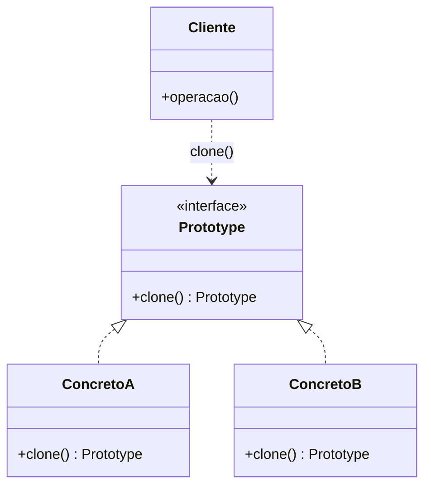
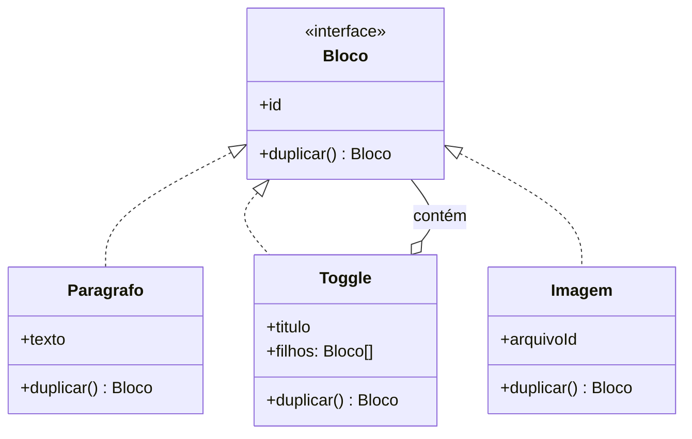

<!--
  ESQUELETO. Os bullets abaixo são anotações do que entra em cada seção —
  não são o texto da página. Substitua cada um pela sua prosa e apague os
  comentários HTML conforme for escrevendo.

  O material completo (com o raciocínio, as tabelas prontas e os pontos em
  aberto) está em RASCUNHO.md, na mesma pasta. Ele sai antes do PR.

  Decisão ainda em aberto (RASCUNHO §14.1): a espinha desta página. Este
  esqueleto assume a que saiu da conversa — "quase sempre é uma função, e
  as duas situações em que não é". Se você escolher outra, a ordem das
  seções 2 a 5 muda.
-->

# Prototype

<!-- Uma frase. O que o pattern faz, sem jargão.
     Núcleo: em vez de construir do zero, pedir a um objeto que já existe
     uma cópia de si mesmo. -->

---

## O problema

<!-- Abrir com "duplicar produto" — a rota que todo SaaS tem e que o leitor
     já escreveu. Ela é o caso comum, e serve para mostrar que o pattern
     NÃO é necessário aqui: é a base de comparação da página inteira. -->

- Cenário: `POST /api/products/:id/duplicate`, o menuzinho de três pontinhos com "Duplicar".
- O código que parece pronto e não está: `const copia = { ...original }`.
- A tabela campo a campo — `id`, `sku`, `nome`, `status`, `categoriaId`, `variantes`, `avaliações`, `estoque`. **Tabela pronta no RASCUNHO §7.**
- O ponto da seção: o spread erra em todas essas linhas, silenciosamente. Produto sai publicado, com estoque do outro, e com SKU que derruba a request.
- Fechar reconhecendo que aqui uma função resolve — a dor ainda não justifica pattern nenhum. Isso prepara a virada da seção "Mas por que não uma função?".

## A ideia

<!-- 3–4 frases. O movimento central. -->

- O objeto pronto e configurado fica guardado em algum lugar; ele é o protótipo.
- Para conseguir mais um igual, você pede a ele: `clone()`. Não usa `new`, não conhece a classe, não lista os campos.
- A consequência que carrega o pattern: **o catálogo do que pode ser criado vira dado, não código.** Cinquenta variações = cinquenta registros e uma classe.
- Corolário para citar aqui: Prototype troca **subclasses por instâncias**. Quando a variação é estado e não comportamento, ela não deveria estar no sistema de tipos.
- Desfazer cedo a leitura errada do diagrama do GoF: o pattern **não cria classe nova**, põe um método numa classe que já existe.

## Mas por que não uma função?

<!-- A objeção central, e provavelmente o coração da página. Ela é o que
     separa este texto dos tutoriais, que nunca fazem essa pergunta.
     Material completo no RASCUNHO §5. -->

- A escolha real não é "classe nova × função", é `duplicarProduto(p)` × `produto.duplicar()`. Uma função contra um método.
- O que o método compra é **uma coisa só**: copiar algo sem saber o que é.
- Se quem chama sempre sabe o tipo concreto, a função é melhor — mais simples, testável sozinha, e não põe persistência dentro da entidade.
- A régua, em 4 casos (tabela pronta no RASCUNHO §5): tipo único → função; poucos tipos fechados → uma função por tipo; **cópia recursiva sobre tipos heterogêneos → método**; conjunto de tipos aberto → método, pelo argumento do OCP.
- Dizer explicitamente que os casos 1 e 2 são a maioria do código de API. Isso é conclusão, não etapa.

## Onde a função quebra

<!-- O contraste com a seção anterior: o caso em que o método se paga.
     Exemplo: página do Notion como árvore de blocos.
     Material completo, com código e tabela, no RASCUNHO §6. -->

- O domínio: página = árvore de blocos heterogêneos (parágrafo, tabela, imagem, toggle, sub-página), e blocos contêm blocos.
- Mostrar o `switch` sobre `bloco.tipo` com a recursão manual. Três problemas, e nomear qual é o fatal:
  1. o `switch` cresce sem parar;
  2. ele precisa conhecer campos internos de trinta classes — encapsulamento vazando;
  3. **todo bloco novo obriga a editar essa função.** O time adiciona "bloco de código", esquece do `switch`, e o bloco some ao duplicar a página.
- Ligar o item 3 ao [Open/Closed](https://github.com/JoaoVitorLima242/project-patterns/tree/main/docs/principios/ocp): o comportamento varia por tipo, então cada tipo traz a própria resposta.
- O contraste final: `paginaRaiz.duplicar()`, recursivo, e o `switch` não existe. E continuam sendo as mesmas trinta classes — nenhuma classe nova.

## Estrutura

<!-- Diagramas enxutos. O primeiro é o canônico; o segundo mostra por que a
     recursão é o que muda o jogo. Avaliar se os dois se pagam ou se o
     segundo basta. -->



<!-- O segundo: a árvore do Notion. O `Toggle o-- Bloco` é o detalhe que
     torna a recursão inevitável — e é ele que justifica o método. -->



## Participantes

| Papel (GoF) | No exemplo | Responsabilidade |
| --- | --- | --- |
| `Prototype` | `Bloco` | Declara `duplicar()`. É o que permite copiar sem conhecer o tipo concreto. |
| `ConcretePrototype` | `Paragrafo`, `Toggle`, `Imagem` | Implementa a cópia de si mesmo — e **decide campo a campo** o que é conteúdo e o que é identidade. |
| `Client` | O caso de uso "duplicar página" | Pede a cópia. Não conhece nenhum tipo concreto. |
| `PrototypeRegistry` | ❓ opcional — o `Map` de estilos, a tabela de templates | Guarda os protótipos por chave. É o participante que torna o catálogo aberto em runtime. |

<!-- O registry não está no diagrama do GoF como participante formal (aparece
     nas notas de implementação, como "prototype manager"). Decidir se entra
     na tabela ou vira seção própria. -->

## Implementação

<!-- Deixar inline só o núcleo (~20-30 linhas). Esqueleto de código pronto
     no RASCUNHO §6 ("Como aplicar de verdade").

     ❓ Os arquivos executáveis ainda não foram decididos (RASCUNHO §14.6).
     Por enquanto a página vive só com os trechos inline. Se forem criados,
     volta a linha "▸ Exemplo completo e executável" em cada <details>, com
     URL completa do GitHub — e valem as três linguagens, três ou nenhuma. -->

<details>
<summary><b>TypeScript</b></summary>

```ts
// `Toggle.duplicar()` chamando `f.duplicar()` sem nenhum if — é esse o ganho,
// e é o único. Mostrar também `Imagem`, que COMPARTILHA o arquivoId em vez
// de copiar o binário: a decisão de domínio escrita onde quem mexe vai olhar.
```

</details>

<details>
<summary><b>Python</b></summary>

```python
# Onde `copy.deepcopy` resolve sozinho — e onde ele erra, porque copia o
# `autor: Usuario` junto. O ponto: a decisão campo a campo não é automatizável.
```

</details>

<details>
<summary><b>Java</b></summary>

```java
// O construtor de cópia, não `Cloneable`. Ver a seção abaixo.
```

</details>

## O que "uma cópia" significa

<!-- Cópia rasa × profunda. Seção própria porque é onde o bug mora — e
     porque a página tem um ângulo que os tutoriais não têm: no backend
     isso não é discussão de ponteiro, é regra de negócio.
     Material no RASCUNHO §8. -->

- O erro mecânico primeiro: `new Grupo(this.filhos)` copia referências; mexer no clone muda o original.
- O conserto pelo próprio pattern: `this.filhos.map(f => f.clone())` — funciona porque `clone()` está na interface, e a recursão cai de graça.
- **A virada da seção: "profunda em tudo" também está errado.** Clonar o `autor: Usuario` junto cria um segundo João no sistema.
- A regra que fica: ao escrever `clone()`, você decide **campo por campo** o que é conteúdo (copia) e o que é identidade (compartilha). Por isso `clone()` gerado por ferramenta quase sempre está errado.
- Amarrar com a tabela do produto lá do começo: `categoriaId` é referência compartilhada, `variantes` é cópia profunda, `avaliações` não vem junto. É a mesma discussão, vestida de negócio.
- Fechar com o caso que nem o Notion resolveu: link para outra página vira a opção "duplicate with subpages" na UI. ❓ confirmar antes de afirmar (RASCUNHO §15).

## O `Cloneable` do Java

<!-- Raro um mecanismo de linguagem ser tão publicamente condenado, e é uma
     lição sobre interface mal desenhada que vale além do pattern.
     Material no RASCUNHO §9. Avaliar se é seção própria ou se cabe dentro
     do <details> do Java. -->

- Interface **vazia** — não declara `clone()`; só muda o comportamento de um método herdado de `Object`.
- `Object.clone()` é `protected`: **a interface não te dá o método que dá nome a ela.**
- Cria o objeto sem passar pelo construtor — fura qualquer invariante.
- Não funciona com campo `final`, então não dá para consertar a cópia rasa.
- Bloch (Item 13): construtor de cópia ou factory de cópia.
- A tese da seção: **o mecanismo está desacreditado, o pattern não.** Construtor de cópia continua sendo Prototype.

## Onde ele aparece de verdade

<!-- ❓ Seção opcional. Ela foi removida do Factory Method (commit d3b42ff),
     então tem precedente contra. Manter só se os exemplos carregarem
     argumento, não se virarem lista. Material no RASCUNHO §11. -->

- `PodTemplate` do Kubernetes — `replicas: 3` é "clone o protótipo três vezes".
- Templates persistidos: contrato, e-mail, assinatura recorrente, checklist. O ponto: quem cria "tipos novos" é o usuário editando um registro; se fosse classe, seria um deploy.
- Dados de teste — `{ ...pedidoBase, status: 'CANCELADO' }`, e a pegadinha do spread raso vazando entre testes. Liga direto com o *Test Data Builder* do [Builder](https://github.com/JoaoVitorLima242/project-patterns/tree/main/docs/patterns/criacionais/builder).
- Motor de jogo — e corrigir o motivo: não é "é caro de construir", é que **o designer edita o `.json` sem chamar o dev**.

## Quando usar

<!-- Sinais concretos, não "quando quer flexibilidade". -->

- Gatilho geral: **existe um objeto de referência guardado** (banco, `Map`, arquivo) e você produz novos a partir dele — principalmente quando quem define esses modelos é o usuário, não o deploy. Se não há modelo salvo, não é este pattern.
- A cópia é recursiva sobre uma estrutura de tipos heterogêneos (o caso do Notion).
- O conjunto de tipos cresce, ou quem chama recebe o objeto por uma interface e não sabe o tipo concreto.
- ❓ O objeto é caro de construir — incluir ou não? É otimização, não design, e é a justificativa mais fraca (RASCUNHO §2b).

## Quando NÃO usar

<!-- A seção mais importante. Material no RASCUNHO §12. -->

- **Um tipo só e quem chama sabe qual é.** Função no service. É a maioria do código de API, e é a resposta certa — não uma etapa até "fazer direito".
- **Response de request comum / entidade que nasce de um POST.** Não há protótipo, não há catálogo. Usar o pattern aí é inventar problema.
- **Objeto imutável.** Aqui mora o contraponto mais forte da página, e talvez mereça mais de um bullet: Prototype pressupõe que você quer a cópia *porque vai modificá-la*. Sem mutação, "cópia" e "referência" são a mesma coisa — compartilha e pronto.
- **Linguagem com `copy`/`with`/spread**, se o problema era só trocar um campo. A mecânica ficou grátis; o que não ficou é a decisão de design.
- Confusão a desfazer: Factory Method fecha o conjunto de tipos em compile time; Prototype abre em runtime.

## Trade-offs

| Ganha | Paga |
| --- | --- |
| <!-- catálogo aberto em runtime: tipo novo sem deploy --> | <!-- ❓ --> |
| <!-- some o switch/if-else sobre tipo; bloco novo já nasce sabendo se copiar --> | <!-- a decisão campo a campo se espalha por N classes, em vez de ficar num lugar só --> |
| <!-- copia sem conhecer a classe concreta nem os campos privados --> | <!-- entidade ganha um método que é fácil de esquecer de atualizar quando entra campo novo --> |
| <!-- a recursão em árvore cai de graça --> | <!-- ❓ cópia rasa é o padrão silencioso: o bug não aparece em teste unitário simples --> |

<!-- O trade-off central, para fechar a seção em prosa: em 1994 o pattern
     comprava a criação polimórfica inteira. Hoje a linguagem entrega a
     mecânica de graça, e o que sobra é a decisão de domínio — muito menos
     terreno do que o diagrama sugere. -->

## Patterns relacionados

- [**Builder**](https://github.com/JoaoVitorLima242/project-patterns/tree/main/docs/patterns/criacionais/builder) — Builder parte do nada e monta passo a passo; Prototype parte de algo que já existe. Quando as variações são pequenas sobre uma base comum, clonar custa menos. <!-- o gancho recíproco já está lá, em builder/README.md:380 — converter em link quando esta página entrar na main -->
- [**Abstract Factory**](https://github.com/JoaoVitorLima242/project-patterns/tree/main/docs/patterns/criacionais/abstract-factory) — a variante que o próprio GoF documenta: a fábrica guarda protótipos e clona, em vez de ter uma subclasse por família. É o *prototype registry*. <!-- gancho recíproco em abstract-factory/README.md:327 -->
- [**Factory Method**](https://github.com/JoaoVitorLima242/project-patterns/tree/main/docs/patterns/criacionais/factory-method) — a diferença que resolve a confusão: lá o conjunto de tipos é fechado em tempo de compilação; aqui é aberto em runtime.
- **Composite** — a estrutura que torna Prototype necessário. A árvore de blocos é um Composite, e é a recursão dela que a função externa não consegue acompanhar. <!-- 🔜 no mapa: fica em negrito, sem link -->
- [**Polimorfismo**](https://github.com/JoaoVitorLima242/project-patterns/tree/main/docs/principios/polymorphism) — o mesmo raciocínio de sempre, aplicado à criação: só o objeto sabe se copiar.
- [**Open/Closed (OCP)**](https://github.com/JoaoVitorLima242/project-patterns/tree/main/docs/principios/ocp) — o argumento do bloco novo esquecido no `switch`.
- [**Encapsulamento**](https://github.com/JoaoVitorLima242/project-patterns/tree/main/docs/principios/encapsulation) — copiar de fora exige conhecer os campos privados. É o motivo de a cópia morar dentro do objeto.

## Referências

<!-- Conferir antes de publicar — ver RASCUNHO §15. -->

- **Design Patterns: Elements of Reusable Object-Oriented Software** — Gamma, Helm, Johnson & Vlissides (1994). ❓ conferir a página. O editor de partitura, e as notas de implementação sobre o *prototype manager* (o registry).
- **Effective Java** — Joshua Bloch, Item 13 na 3ª edição ("Override clone judiciously"). ❓ conferir o número na 2ª. Por que `Cloneable` é quebrado e por que construtor de cópia é melhor.
- [Prototype](https://refactoring.guru/design-patterns/prototype) — Refactoring Guru. A estrutura desenhada e o registry.
- ❓ Brandon Rhodes / python-patterns.guide — procurar se há página sobre Prototype. Serviu bem no Builder.
- ❓ Docs do Kubernetes sobre `PodTemplate` — para o exemplo de registry em produção.
- ❓ Docs do Notion sobre duplicar página com sub-páginas — confirmar a opção na UI antes de afirmar.
