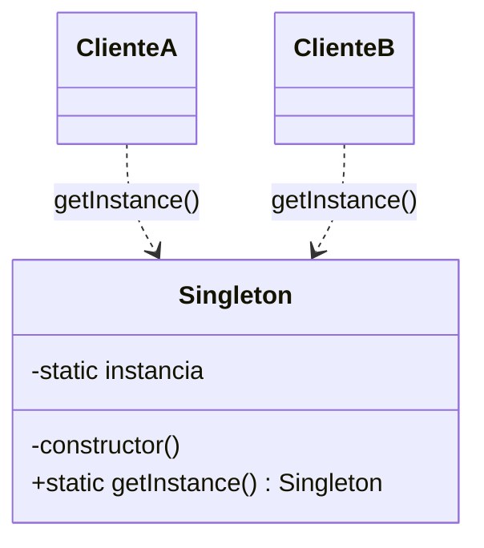
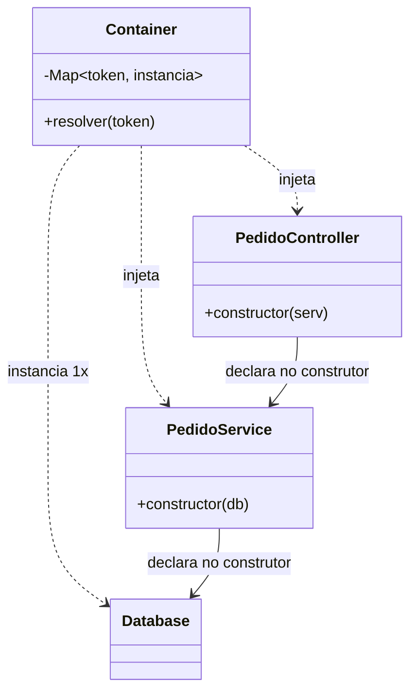

# Singleton

Garante que uma classe tenha uma única instância e dá acesso global a ela.

São duas promessas numa frase só. A primeira você quase sempre quer; a segunda é a que cobra o preço — e a boa notícia é que elas nunca precisaram vir juntas.

---

## O problema

Você precisa de uma conexão com o banco. Uma, não trinta. A solução aparece pronta:

```ts
class Database {
  private static instancia: Database

  static getInstance(): Database {
    if (!Database.instancia) Database.instancia = new Database(config)
    return Database.instancia
  }
}
```

E daí em diante, de qualquer lugar:

```ts
const rows = await Database.getInstance().query('select ...')
```

Antes de qualquer crítica, é honesto reconhecer **por que isso é tão usado**: resolve um problema real com uma linha, não exige container, não exige wiring, e não obriga a mexer em nenhum caminho de chamada. Quem precisa, pega. Em código pequeno, é difícil argumentar contra.

O incômodo não chega de uma vez. Ele chega assim:

```
Database.getInstance()
   ↓  o teste precisa de um banco fake        → não dá para substituir
   ↓  entra uma read replica                  → precisa de duas
   ↓  entra multi-tenant                      → precisa de uma por cliente
   ↓  o dev roda em hot reload                → cada reload cria mais uma
```

Repare no que essas quatro linhas têm em comum. Nenhuma delas diz que o pattern está mal implementado. Todas dizem a mesma coisa: **o número de instâncias mudou**.

E aí está a armadilha, que é fácil de não enxergar enquanto o número é um:

> "Quantas instâncias existem" é uma decisão de **configuração** — muda com ambiente, com cliente, com deploy. O Singleton promove essa decisão a **invariante de classe**, escrita no código, onde ela é cara de desfazer.

O último item da escada merece um parágrafo próprio porque quase todo backend Node já bateu nele. Em desenvolvimento, o hot reload reavalia o módulo; cada reavaliação constrói outro cliente; em poucos minutos o Postgres recusa conexão por excesso. A correção que virou padrão — documentada no Prisma, no Firebase e em praticamente todo projeto Next.js — é guardar a instância fora do módulo:

```ts
const g = globalThis as { db?: Database }
export const db = g.db ?? (g.db = new Database(config))
```

Guarde essa linha. Ela vai reaparecer, e prova uma coisa desconfortável sobre a promessa do pattern.

## As duas metades

A definição original do GoF é esta:

> *"Ensure a class has only one instance, and provide a global point of access to it."*

Duas cláusulas grampeadas, e vinte anos de crítica atacando **só a segunda**.

- **"Uma instância só"** é um requisito comum e legítimo. Um pool de conexões, um cache, um cliente de SDK. Ninguém quer trinta.
- **"Ponto de acesso global"** é a origem de todo o dano que se atribui ao pattern.

O detalhe que organiza esta página inteira: **a segunda cláusula não é necessária para conseguir a primeira**. Dá para ter exatamente uma instância sem que ela seja alcançável de qualquer lugar. É o que a próxima metade do texto mostra — e é o que você provavelmente já faz sem chamar por esse nome.

O peso dessa crítica dá para medir por quem a assina. Em 2009, numa entrevista com os três autores do livro sobre o que mudariam quinze anos depois, Erich Gamma disse:

> *"I'm in favor of dropping Singleton. Its use is almost always a design smell."*

Foi o único pattern que ele quis remover do catálogo.

## O dano, em concreto

"É global, e global é ruim" não ajuda ninguém. Os três danos específicos foram catalogados por Miško Hevery em 2008, e a literatura posterior basicamente os repete.

**1. A assinatura mente.**

```ts
const service = new PedidoService()   // não pede nada
```

Por dentro, ele chama `Database.getInstance()`. Não há como saber do que essa classe depende olhando para ela — só lendo o corpo dela inteiro, e o corpo de tudo que ela chama. O título do artigo do Hevery é *"Singletons are Pathological Liars"*, e é exatamente sobre isso: a API declara uma coisa e faz outra.

É a mesma inversão que o [DIP](https://github.com/JoaoVitorLima242/project-patterns/tree/main/docs/principios/dip) descreve, com um agravante — a dependência não está apenas na direção errada, ela está **invisível**.

**2. O global se propaga.**

Este é o argumento menos citado e o mais grave. Se uma instância global tem estado, tudo que está dentro dela também é alcançável globalmente, e tudo que está dentro disso também. Você não introduziu um global; introduziu a **árvore inteira** pendurada nele.

**3. O teste passa sozinho e quebra na suíte.**

Estado mutado num teste sobrevive para o próximo. Testes ficam dependentes de ordem, e paralelizar vira um jogo de azar. Como `getInstance()` devolve a classe concreta, não há como injetar um fake — a saída usual é expor um `Database.reset()`, ou seja, **código de produção com porta dos fundos que só existe para o teste**.

## A garantia é mais fraca do que parece

Antes de discutir alternativas, vale destruir uma premissa: `getInstance()` **não** garante uma instância no sistema. Garante uma por escopo de carregamento — e esse escopo você não escolheu.

| Ambiente | Você tem um por... |
| --- | --- |
| Node com ESM + CommonJS | cópia do módulo — o mesmo pacote importado pelos dois caminhos são **dois** |
| Hot reload em dev | reavaliação do módulo |
| Serverless | invocação fria, e elas não se falam |
| Escala horizontal | pod, container, réplica |

O caso do Node tem nome — *dual package hazard* — e consequências que passam despercebidas: até `instanceof` falha entre as duas cópias. Não é teórico: o `firebase-functions` precisou resolver isso em produção guardando a instância em `globalThis` sob uma chave `Symbol.for` versionada, e ainda implementar um `Symbol.hasInstance` customizado para o `instanceof` voltar a funcionar entre fronteiras de pacote.

Agora releia aquela linha lá do começo:

```ts
const g = globalThis as { db?: Database }
export const db = g.db ?? (g.db = new Database(config))
```

Para conseguir "uma instância só", foi preciso **sair do escopo do módulo e escrever no objeto global do runtime**. Times competentes chegaram nisso de forma independente, o que é a melhor prova possível de que o mecanismo da classe nunca garantiu nada sozinho.

A consequência prática é dura: se o motivo de existir "um só" for **correção** — um lock, um contador, uma sequência, um cache que precisa ser coerente — o Singleton não entrega isso nem dentro de um processo, quanto mais com duas réplicas no ar. Nesse caso o problema é de infraestrutura (Redis, banco, lock distribuído), e nenhum pattern de objeto vai resolver.

## Em TypeScript e Python, o pattern quase não se escreve

Aqui o repositório repete uma conclusão que já apareceu no [Builder](https://github.com/JoaoVitorLima242/project-patterns/tree/main/docs/patterns/criacionais/builder) e no [Prototype](https://github.com/JoaoVitorLima242/project-patterns/tree/main/docs/patterns/criacionais/prototype): **o mecanismo é da linguagem, não do pattern.**

Um módulo é avaliado uma vez e cacheado. Isso já é um singleton, e sem nenhuma cerimônia.

## Estrutura

O desenho clássico tem um participante só, e é isso que deveria chamar atenção:



As setas partem dos clientes e chegam na classe concreta, sem nada no meio. Não há como interceptar, substituir ou configurar — não existe um lugar onde a decisão more.

Compare com o desenho que resolve o mesmo requisito por outro caminho:



Continua existindo **uma** instância de `Database`. O que mudou é quem sabe disso: a classe deixou de ser responsável pela própria cardinalidade, e as dependências passaram a estar declaradas.

## Participantes

| Papel | No pattern clássico | Na versão com container |
| --- | --- | --- |
| `Singleton` | a classe, com `static instancia` e construtor privado | um provider comum, sem nada de especial |
| `Client` | qualquer código, chamando `getInstance()` de onde estiver | quem declara a dependência no construtor |
| **quem guarda a instância** | **a própria classe** | **o container** |

A última linha é a diferença inteira. No pattern clássico esse participante não existe como entidade separada — a classe acumula duas responsabilidades que não têm relação (fazer o seu trabalho, e administrar quantas cópias dela existem). É uma violação de [SRP](https://github.com/JoaoVitorLima242/project-patterns/tree/main/docs/principios/srp) que passa despercebida porque a segunda responsabilidade cabe em cinco linhas.

## Implementação

<details>
<summary><b>TypeScript — o módulo já é o pattern</b></summary>

```ts
// database.ts
class Database {
  private pool: Pool

  constructor(config: Config) {
    this.pool = criarPool(config)
  }

  query(sql: string) { /* ... */ }
}

export const db = new Database(config)   // avaliado uma vez, cacheado pelo runtime
```

Sem `static instancia`, sem construtor privado, sem *lazy init*, sem verificação de corrida. O `import` faz o trabalho.

E note o que **não** se perdeu: a classe continua com construtor público. Quem precisar de uma segunda instância — um teste, uma read replica — simplesmente chama `new Database(outraConfig)`. A conveniência do módulo não custou a possibilidade de ter duas.

Escrever `getInstance()` por cima disso adiciona cerimônia e remove essa saída.

</details>

<details>
<summary><b>Python — idem, e sem metaclasse</b></summary>

```python
# config.py
class Settings:
    def __init__(self, env: str) -> None:
        self.env = env
        ...

settings = Settings(env=os.environ["ENV"])   # o módulo é importado uma vez
```

```python
from config import settings
```

O módulo é executado na primeira importação e fica em `sys.modules`. As soluções que circulam em tutorial — sobrescrever `__new__`, uma metaclasse `SingletonMeta`, um decorator `@singleton` — resolvem um problema que o interpretador já tinha resolvido, e cobram legibilidade por isso.

Vale a mesma observação do TypeScript: `Settings` continua instanciável. O teste faz `Settings(env="test")` e segue a vida.

</details>

## O que o Nest faz diferente

Se você trabalha com Nest, já usa a versão boa deste pattern todos os dias — e provavelmente sem chamá-la assim.

No Nest, o escopo padrão de um provider é singleton. A documentação é literal: *"A single instance of the provider is shared across the entire application. The instance lifetime is tied directly to the application lifecycle."* Todo `@Injectable()` escrito sem pensar já é uma instância única, criada no boot.

Mas olhe **como** ela chega:

```ts
@Injectable()
export class PedidoService {
  constructor(private readonly db: DatabaseService) {}
}
```

Uma instância só de `DatabaseService` no processo inteiro — e, mesmo assim:

- a dependência **está na assinatura**, então a API não mente;
- dá para substituir no teste com `overrideProvider`, sem porta dos fundos na classe;
- dá para ter duas quando o mundo mudar, sem tocar na classe.

Esse último ponto é a escada da cardinalidade sendo desarmada. Duas instâncias da mesma classe custam um registro:

```ts
providers: [
  { provide: 'DB_PRIMARY', useFactory: () => new Database(urlPrimary) },
  { provide: 'DB_REPLICA', useFactory: () => new Database(urlReplica) },
]
```

Nenhuma linha de `Database` mudou. Com `getInstance()`, isso exigiria reescrever a classe e todos os pontos de chamada.

### A unicidade é por registro, não por classe

É o detalhe que mais gera confusão, e ele importa. "Singleton" no Nest não significa "uma instância desta classe no processo" — significa **uma por registro no container**.

Exportar e importar compartilha: *"any module that imports the `CatsModule` [...] will share the same instance with all other modules that import it as well."*

Declarar duas vezes duplica. Se dois módulos listam a mesma classe nos próprios `providers`, existem duas instâncias — e a documentação avisa do efeito: *"it could also cause unexpected behavior, such as state inconsistency if the service maintains any internal state."*

É o mesmo acidente do *dual package hazard*, de roupa nova: **você acha que tem um e tem dois**. A diferença é que aqui o mecanismo está visível num array, em vez de escondido no resolvedor de módulos.

E o framework ainda oferece o botão de volta:

```ts
@Global()
@Module({ providers: [ConfigService], exports: [ConfigService] })
export class ConfigModule {}
```

`@Global()` torna os exports alcançáveis de qualquer lugar sem importar nada — ou seja, restaura exatamente a segunda metade da definição do GoF, com todos os custos que ela traz. A documentação desencoraja o uso frequente, e agora dá para dizer por quê.

### O bug que o padrão silencioso causa

Como singleton é o default e ninguém precisa declarar isso, é fácil esquecer:

```ts
@Injectable()
export class RelatorioService {
  private usuarioAtual: Usuario          // ⚠️ isto é do processo, não da requisição

  async gerar(req: Request) {
    this.usuarioAtual = req.user         // a requisição B sobrescreve o que a A está usando
    return this.montar()
  }
}
```

Parece um campo de instância. É estado global. Dois usuários simultâneos, e um vê os dados do outro — o pior bug que um backend pode ter, nascido de **não perceber que o objeto é único**.

É o mesmo fenômeno que quebra suítes de teste, agora em produção e com dados de gente real. E note que não há um `getInstance()` em lugar nenhum: o dano nunca veio da sintaxe do pattern, e sim de **estado mutável num objeto que muita gente alcança**.

A saída existe e tem preço. Marcar o provider como `REQUEST` cria uma instância por requisição, mas o escopo **sobe na cadeia**: quem depende dele também vira request-scoped, e o Nest passa a construir essa árvore a cada chamada. A documentação estima algo em torno de 5% de latência a mais numa aplicação bem desenhada, e recomenda o singleton como padrão.

O que leva à regra que evita o problema na origem: **serviço bem escrito é stateless**. Estado que varia por requisição pertence ao argumento do método, não a um campo do objeto. Quando o serviço não tem estado, a pergunta "quantas instâncias existem" deixa de ter consequência.

## Quando usar

- **Objetos imutáveis e sem estado.** Um comparador, um *null object*, uma tabela de constantes. Uma instância única aqui é só economia de alocação, e nenhum dos danos desta página se aplica.
- **Quando a linguagem já entrega.** Um módulo com `export const` em TypeScript ou uma instância no topo do módulo em Python. É o caminho mais curto, e mantém o construtor aberto para quem precisar de outra.
- **Recurso caro com dono claro**, desde que a instância seja **injetada** e não alcançada: pool de conexões, cliente de SDK, cache. É o escopo singleton do container — uma instância, dependência declarada.
- **Logger.** O caso limítrofe honesto. Sobrevive porque é *write-only*: não devolve valor, não altera o comportamento de quem chama, e por isso o acoplamento a ele quase não dói. Ainda assim, é acoplamento — e a razão de tolerá-lo é conveniência, não desenho.

## Quando NÃO usar

- **Quando o objeto tem estado mutável e muita gente o alcança.** É a combinação que produziu toda a crítica das últimas duas décadas. Um dos dois fatores sozinho é administrável; os dois juntos, não.
- **Quando "um só" é requisito de correção.** Lock, contador, sequência, idempotência. O pattern não garante isso com duas réplicas, nem com dois carregamentos do mesmo módulo. O lugar dessa garantia é a infraestrutura.
- **Quando existe um container à mão.** Se você já usa Nest, ou qualquer DI, escrever `getInstance()` é abrir mão de graça de substituição em teste, de dependência declarada e de cardinalidade configurável.
- **Para evitar passar a dependência.** Este é o motivo real na maioria das vezes, e vale ser franco: `getInstance()` costuma ser escolhido para não ter que declarar o parâmetro e ajustar os pontos de chamada. O trabalho evitado é pequeno; o que se compra em troca é uma dependência que ninguém consegue ver.
- **Como cache "porque construir é caro".** É otimização, e merece um benchmark antes de merecer uma decisão de design.

Uma confusão que vale desfazer, porque o vocabulário atrapalha: **`singleton` como escopo de DI não é o Singleton do GoF.** Mesmo nome, desenhos opostos.

| | **Singleton, o pattern** | **`singleton`, o escopo** |
| --- | --- | --- |
| Quem garante a unicidade | a própria classe | o container |
| Como se chega nele | `Classe.getInstance()`, de qualquer lugar | injetado, declarado no construtor |
| Substituível no teste | não | sim |
| Ter dois quando precisar | exige reescrever | é registro |

## Trade-offs

| Ganha | Paga |
| --- | --- |
| Uma linha resolve; sem container, sem wiring, sem tocar em caminho de chamada | A dependência some da assinatura, e a classe passa a mentir sobre o que precisa |
| Qualquer código alcança o recurso de onde estiver | Qualquer código alcança o recurso de onde estiver |
| Uma instância só de um recurso caro | A cardinalidade vira invariante de código, quando era decisão de configuração |
| Inicialização preguiçosa, na primeira chamada | Ninguém é dono do ciclo de vida: não há onde interceptar, configurar ou destruir |

A segunda linha não é erro de digitação. **O mesmo atributo é a vantagem e o defeito**, e é por isso que a discussão nunca fecha: quem defende e quem ataca o pattern estão descrevendo a mesma propriedade, avaliada em escalas de código diferentes. Com trezentas linhas, alcançar de qualquer lugar é conveniência. Com trinta mil, é a razão de ninguém conseguir mudar nada com segurança.

Daí a régua que resume a página:

> O estrago é proporcional ao **estado mutável** e ao **número de lugares que alcançam**. Sem estado, o Singleton é inofensivo. Com estado e alcance amplo, é a origem de bugs que não reproduzem.

E o desfecho é menos dramático do que a fama sugere. A metade útil da definição venceu — toda aplicação séria tem uma instância só do pool de conexões. O que se perdeu foi a segunda metade, e junto com ela o `getInstance()`. Hoje a unicidade é um **atributo de configuração**, resolvido por quem monta a aplicação, e não uma propriedade que a classe impõe a si mesma.

## Patterns relacionados

- [**Abstract Factory**](https://github.com/JoaoVitorLima242/project-patterns/tree/main/docs/patterns/criacionais/abstract-factory) — o próprio GoF sugere implementar a `ConcreteFactory` como Singleton, já que costuma bastar uma. É o exemplo perfeito do bom uso virando problema: a fábrica única é razoável, e alcançá-la globalmente é o que dificulta trocar de família no teste.
- [**Factory Method**](https://github.com/JoaoVitorLima242/project-patterns/tree/main/docs/patterns/criacionais/factory-method) — `getInstance()` é um *static factory method* que, além de criar, decide sozinho quantos existem. Separar as duas responsabilidades é metade do caminho para sair do Singleton.
- [**Prototype**](https://github.com/JoaoVitorLima242/project-patterns/tree/main/docs/patterns/criacionais/prototype) — o oposto exato na mesma família: um garante que existe apenas um, o outro existe para produzir muitos a partir de um modelo.
- [**Dependency Inversion (DIP)**](https://github.com/JoaoVitorLima242/project-patterns/tree/main/docs/principios/dip) — o princípio que o Singleton viola de forma mais direta, e a alternativa concreta a ele. Vale notar a fricção prática no Nest: como interface do TypeScript não existe em runtime, o caminho fácil injeta a **classe concreta** — depender da abstração custa um token explícito.
- [**Single Responsibility (SRP)**](https://github.com/JoaoVitorLima242/project-patterns/tree/main/docs/principios/srp) — a classe faz o trabalho dela e ainda administra quantas cópias de si mesma existem. São dois motivos para mudar.
- [**Acoplamento e Coesão**](https://github.com/JoaoVitorLima242/project-patterns/tree/main/docs/principios/coupling-and-cohesion) — o vocabulário para explicar por que o acesso global dói: ele cria acoplamento que não aparece em nenhuma assinatura.

## Referências

- **Design Patterns: Elements of Reusable Object-Oriented Software** — Gamma, Helm, Johnson & Vlissides (1994), p. 127. A definição em duas cláusulas, e a nota de que a `ConcreteFactory` do Abstract Factory costuma ser um Singleton.
- [Design Patterns 15 Years Later: An Interview with Erich Gamma, Richard Helm, and Ralph Johnson](https://www.informit.com/articles/article.aspx?p=1404056) — InformIT, 2009. Gamma: *"I'm in favor of dropping Singleton. Its use is almost always a design smell."* O único pattern que ele quis remover do catálogo.
- [Singletons are Pathological Liars](https://testing.googleblog.com/2008/08/by-miko-hevery-so-you-join-new-project.html) e [Root Cause of Singletons](https://testing.googleblog.com/2008/08/root-cause-of-singletons.html) — Miško Hevery, Google Testing Blog, 2008. A API que mente, a propagação transitiva do estado global, e por que a suíte de testes é a primeira a sofrer.
- [Injection scopes](https://docs.nestjs.com/fundamentals/injection-scopes) — NestJS. `DEFAULT`, `REQUEST` e `TRANSIENT`, a subida de escopo na cadeia e o custo em latência.
- [Modules](https://docs.nestjs.com/modules) — NestJS. Por que exportar e importar compartilha a instância, e por que declarar em dois módulos cria duas.
- [dual-package-hazard](https://github.com/GeoffreyBooth/dual-package-hazard) — Geoffrey Booth. O mesmo pacote carregado por ESM e CommonJS produz duas instâncias, e `instanceof` falha entre elas.
- [firebase-functions#1780](https://github.com/firebase/firebase-functions/pull/1780) — o caso real: `globalThis` com chave `Symbol.for` versionada para os dois builds compartilharem a mesma instância.
