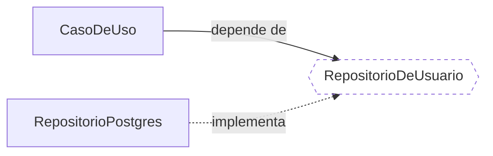

# Dependency Inversion Principle (DIP)

O seu código não deve depender da implementação de uma classe de nível mais baixo. Deve depender de um contrato.

---

## A ideia

Basicamente: o nosso código não deve depender da implementação de classes de nível mais baixo. Em vez disso, a gente depende de **contratos e abstrações**.

O caso de uso não conhece o Postgres, não conhece o provedor de e-mail, não conhece a API do gateway de pagamento. Ele conhece um contrato que diz o que precisa acontecer, e alguém de fora entrega uma implementação que cumpre aquilo.

## Por que é a regra que eu mais uso

Essa é a que eu mais aplico no dia a dia, e o motivo é a arquitetura.

A gente usa **Clean Architecture** para separar as camadas do código, e o DIP é o que faz essa separação existir de verdade. Sem ele as camadas são só pastas com nomes bonitos — o caso de uso continua importando o cliente do banco de dados direto, e a fronteira não segura nada.

Dois ganhos concretos, que são os que me fazem usar isso sempre:

- **Testar fica fácil.** Como a classe recebe o contrato, no teste eu entrego uma implementação de mentira e pronto. Não preciso subir banco, não preciso de rede, não preciso de mock de biblioteca.
- **Trocar o adapter fica isolado.** A implementação concreta vira um detalhe plugado na borda. Trocar o provedor mexe no adapter, e o miolo do sistema não fica sabendo.

O mecanismo é sempre o mesmo: **injetar o contrato na classe, em vez da implementação direta.**

Na prática o que eu faço é criar um contrato para conversar com aquilo. Um repositório de usuário, por exemplo: o contrato diz o que dá para fazer com usuário, e eu posso usar qualquer banco por trás, desde que ele respeite o contrato. A classe que consome integra com o contrato e nunca com o banco.

## DIP não é injeção de dependência

Essas três coisas vivem sendo tratadas como sinônimo, e não são:

| | O que é |
| --- | --- |
| **DIP** | A regra de **direção**: depender de abstração, e a abstração pertence à camada de cima. |
| **Injeção de dependência** | O **mecanismo** de entrega: construtor, setter, parâmetro. |
| **Container de IoC** | A **ferramenta** que automatiza a fiação. |

Dá para fazer injeção sem DIP: se você recebe `RepositorioPostgres` pelo construtor, injetou — e continuou dependendo da implementação. O construtor não salva ninguém; o que salva é o tipo do parâmetro ser o contrato.

E dá para fazer DIP sem container nenhum, montando as dependências na mão no ponto de entrada da aplicação. Container é conveniência, não é o princípio.

## De onde vem a palavra "inversão"

Vale entender o que exatamente está sendo invertido, porque o nome não é óbvio.

Num sistema em camadas tradicional, a dependência segue o fluxo de execução. O caso de uso chama o repositório, então o caso de uso **importa** o repositório:


O problema é que a seta aponta da política para o detalhe. Quem manda no sistema passa a depender de quem devia ser plugável.

Com o DIP, o contrato passa a **pertencer à camada de cima**, e é a implementação que se curva para atendê-lo:



O fluxo de execução continua igual: o caso de uso ainda chama o Postgres em runtime. O que virou do avesso foi a **dependência de código-fonte** — agora ela aponta contra o fluxo. Essa é a inversão.

E daí sai o detalhe que decide se o DIP foi aplicado ou não: **o contrato pertence a quem consome, não a quem implementa.** Se a interface mora junto do adapter e é escrita espelhando o que aquele adapter sabe fazer, você não inverteu nada — só acrescentou um arquivo no meio do caminho. É a mesma regra que aparece no [ISP](https://github.com/JoaoVitorLima242/project-patterns/tree/main/docs/principios/isp): a interface é do cliente.

## Como fica

Um caso de uso de criar usuário, em TypeScript.

### Antes — o caso de uso instancia o banco dentro de si

```ts
class CriarUsuario {
  // A dependência nasce aqui dentro. Quem consome o caso de uso não tem como
  // interferir: para rodar isto, é Postgres ou nada.
  private repositorio = new RepositorioPostgres();

  exec(email: string): string {
    if (this.repositorio.buscarPorEmail(email) !== null) {
      return `✗ e-mail já cadastrado: ${email}`;
    }
    this.repositorio.salvar({ email });
    return `Usuário criado: ${email}`;
  }
}
```

Não dá para testar sem um banco de pé, e trocar o adapter significa editar o caso de uso — que é justamente o código que não devia mudar por causa de infraestrutura.

### Depois — o caso de uso recebe o contrato

```ts
// O contrato pertence à camada de cima: diz o que o caso de uso precisa,
// não o que um banco específico sabe fazer. Repare que não tem SQL aqui.
interface RepositorioDeUsuario {
  buscarPorEmail(email: string): Usuario | null;
  salvar(usuario: Usuario): void;
}

class CriarUsuario {
  private repositorio: RepositorioDeUsuario;

  // O que caracteriza o DIP é o TIPO do parâmetro ser o contrato.
  // Vir pelo construtor é só o mecanismo.
  constructor(repositorio: RepositorioDeUsuario) {
    this.repositorio = repositorio;
  }

  exec(email: string): string {
    if (this.repositorio.buscarPorEmail(email) !== null) {
      return `✗ e-mail já cadastrado: ${email}`;
    }
    this.repositorio.salvar({ email });
    return `Usuário criado: ${email}`;
  }
}

// Adapters plugados na borda. O caso de uso não conhece nenhum dos dois.
class RepositorioPostgres implements RepositorioDeUsuario { /* fala SQL */ }
class RepositorioEmMemoria implements RepositorioDeUsuario { /* guarda num Map */ }
```

O `exec` não mudou uma linha. O que mudou foi de onde vem o repositório — e com isso o teste passa a ser `new CriarUsuario(new RepositorioEmMemoria())`, sem banco, sem rede e sem mock de biblioteca.

▸ [Exemplo completo e executável](https://github.com/JoaoVitorLima242/project-patterns/blob/main/docs/principios/dip/typescript/main.ts)

> **Em outras linguagens:** o mesmo exemplo em [Python](https://github.com/JoaoVitorLima242/project-patterns/blob/main/docs/principios/dip/python/main.py) e [Java](https://github.com/JoaoVitorLima242/project-patterns/blob/main/docs/principios/dip/java/Main.java), com saída idêntica. Em Python o contrato é um `Protocol`, satisfeito estruturalmente — o adapter não declara que implementa nada, basta ter os métodos.

## Princípios relacionados

- **[Open/Closed (OCP)](https://github.com/JoaoVitorLima242/project-patterns/tree/main/docs/principios/ocp)** — o OCP quer que comportamento novo entre sem editar o que já funciona; o DIP diz para onde a dependência precisa apontar para isso ser possível. A injeção que aparece lá é DIP em ação.
- **[Interface Segregation (ISP)](https://github.com/JoaoVitorLima242/project-patterns/tree/main/docs/principios/isp)** — o ISP decide o **formato** do contrato: o que entra e o que fica de fora. O DIP decide de que **lado** ele mora e para onde a dependência aponta. Os dois concordam num ponto: o contrato é de quem consome.
- **[Liskov Substitution (LSP)](https://github.com/JoaoVitorLima242/project-patterns/tree/main/docs/principios/lsp)** — o DIP é o que torna a substituição possível, ao fazer o código depender do contrato. O LSP é o que diz se uma implementação específica pode mesmo ocupar aquele lugar sem quebrar quem chama.
