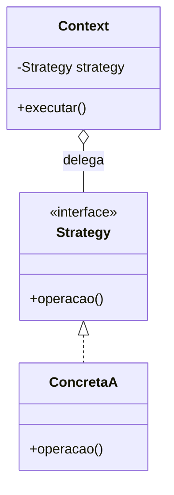

<!--
  Modelo de página. Copie este arquivo para docs/<seção>/<...>/<nome>/README.md
  e preencha. Apague os comentários HTML (como este) conforme for escrevendo.

  Regra de ouro: as seções "Quando NÃO usar" e "Trade-offs" são as que dão
  valor real ao doc. Qualquer tutorial ensina a implementar; poucos dizem
  quando o pattern é a escolha errada.
-->

# Nome do Pattern

<!-- Uma frase dizendo o que o pattern faz. Sem jargão, sem "encapsula a
     variação de..." — a frase que você usaria explicando pra alguém no café. -->

---

## O problema

<!-- Comece pela dor, não pela solução. Descreva um cenário concreto onde o
     código sem o pattern começa a doer: o if/else que cresce, a classe que
     muda por três motivos diferentes, a duplicação que aparece.

     Se ajudar, mostre o código ruim aqui. Ver o problema torna a solução
     óbvia — e é o que faz o leitor lembrar do pattern meses depois. -->

## A ideia

<!-- A solução em 3–4 frases. O movimento central que o pattern faz. -->

## Estrutura

<!-- O GitHub renderiza Mermaid nativamente: diagrama sem imagem e sem build.
     Mantenha o diagrama enxuto — só os participantes e as relações. -->



## Participantes

| Papel | Responsabilidade |
| --- | --- |
| `Nome` | O que faz, em uma linha. |
| `Nome` | |

## Implementação

<!-- Um bloco <details> por linguagem. É o substituto de "abas" no Markdown
     puro: a página não fica gigante com três implementações abertas.

     Deixe INLINE apenas o núcleo do pattern (~20–30 linhas). O setup, o main
     e os prints ficam só no arquivo executável — assim o trecho daqui não
     vira uma cópia inteira que diverge do arquivo com o tempo. -->

<details>
<summary><b>TypeScript</b></summary>

```ts
// núcleo do pattern
```

▸ [Exemplo completo e executável](./typescript/main.ts)

</details>

<details>
<summary><b>Python</b></summary>

```python
# núcleo do pattern
```

▸ [Exemplo completo e executável](./python/main.py)

</details>

<details>
<summary><b>Java</b></summary>

```java
// núcleo do pattern
```

▸ [Exemplo completo e executável](./java/Main.java)

</details>

## Quando usar

<!-- Sinais concretos no código que indicam que este pattern se encaixa.
     "Quando você tem várias formas de fazer X e escolhe entre elas em runtime"
     é melhor que "quando quer flexibilidade". -->

- 
- 

## Quando NÃO usar

<!-- A seção mais importante. Onde o pattern é overkill, que problema ele NÃO
     resolve, e com qual pattern ele costuma ser confundido. -->

- 
- 

## Trade-offs

| Ganha | Paga |
| --- | --- |
|  |  |

## Patterns relacionados

<!-- Links cruzados. Diga a DIFERENÇA, não só o nome — é o que resolve a
     confusão entre patterns de estrutura parecida. -->

- **[Nome](../caminho/)** — em que difere deste.

## Referências

- 
